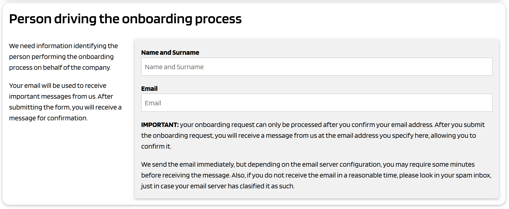
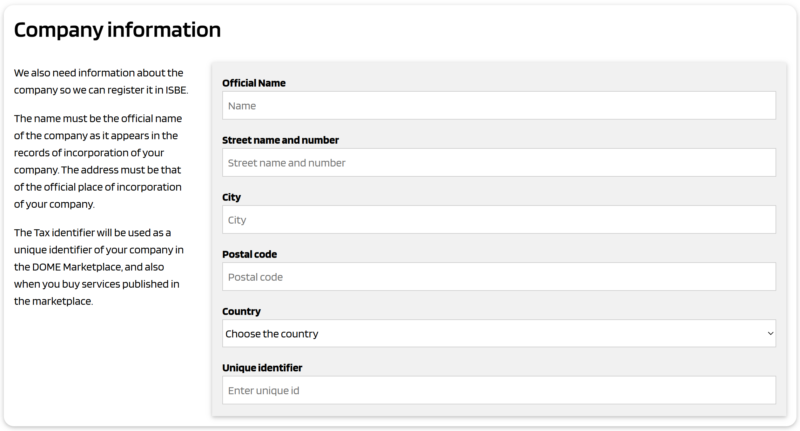
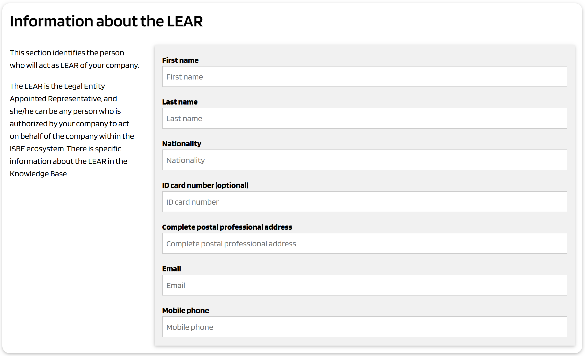

# Onboarding en ISBE - Identidad de las organizaciones y de los empleados de las organizaciones - Credenciales verificables

# Onboarding en ISBE

## Introducción

Antes de poder interactuar en el ecosistema ISBE, una organización debe registrarse siguiendo el proceso de onboarding de ISBE, independientemente del motivo por el cual la organización desea unirse a ISBE (como por ejemplo añadir un nodo regular a una de las redes blockchain, publicar una solución en el Catálogo ISBE, etc.).

ISBE tiene una naturaleza única, como colaboración público-privada española con participación de la Administración pública y un objetivo sin ánimo de lucro. Por ello, el proceso de onboarding debe ser eficiente y jurídicamente seguro, altamente digital y automatizado, al tiempo que minimiza el trabajo manual para ISBE.

Para que ISBE cumpla con la regulación aplicable y verifique con alto nivel de certeza legal que una organización (española o de otro país de la UE/EEE) tiene sede o establecimiento en la UE/EEE, debe seguir un proceso de onboarding/KYC mínimo pero robusto.

> [!Note]
>
> Aunque todavía está pendiente el determinar exactamente la regulación aplicable a la futura entidad legal que operará ISBE, posiblemente algunos de los requisitos regulatorios clave sean:
>
> 1. **Directivas contra el Blanqueo de Capitales (AML/CFT):**
>    - 5ª Directiva (UE) 2018/843 y 6ª Directiva (UE) 2021/1237, transpuestas en España por la Ley 10/2010.
>    - Requieren la verificación de la identidad de clientes empresariales ("Know Your Business Customer" o KYBC), incluyendo sede y beneficiarios reales.
> 2. **Reglamento de Servicios Digitales (DSA - Digital Services Act, Reglamento (UE) 2022/2065):**
>    - Artículo 24: Obliga a las plataformas en línea a verificar la información de los "traders" (empresas que venden servicios/bienes).
>    - Exige recopilar, verificar y mantener datos actualizados de la empresa (nombre, dirección, registro legal, identificación fiscal).
> 3. **Reglamentos de Mercado Interior (e.g., Directiva de Servicios 2006/123/CE):**
>    - Requieren no discriminar empresas de otros Estados miembro y basarse en registros oficiales para verificar su legitimidad.
> 4. **GDPR (Reglamento (UE) 2016/679):**
>    - Aplica al tratamiento de datos personales durante el onboarding (ej. datos de representantes legales).

La utilización de **certificados electrónicos cualificados en el marco eIDAS** (que abreviaremos como "certificados eIDAS") para la firma de un contrato de la organización con ISBE simplifica significativamente el proceso de onboarding, ya que estos instrumentos tienen **valor probatorio reforzado** bajo el Reglamento eIDAS (UE 910/2014) y presunción de autenticidad e integridad, además de minimizar el riesgo legal en caso de repudio de la firma.

Una estimación razonable es que el uso de **QSeal o certificados de representación cualificados** permite:

- **Eliminar el 80% de la carga manual** para ISBE (verificación de registros, poderes, documentos físicos).
- **Mantener un nivel de certeza legal máximo** (presunción reglamentaria bajo eIDAS) y reducir el riesgo para ISBE.
- **Cumplir con DSA, AML y GDPR** de manera eficiente.
- **Proporciona un mejor servicio** ya que el proceso de onboarding es más sencillo y rápido al evitar mucho trabajo manual.

En este documento se describe un proceso de onboarding basado en firmas avanzadas o cualificadas usando certificados cualificados. Posteriormente. se describen también las posibles dificultades y puntos de fricción, principalmente para organizaciones en países diferentes a España, con una adopción más baja de la firma electrónica basada en dichos certificados.

El proceso de onboarding no acaba con el registro de la organización en ISBE, sino que además debemos permitir que inmediatamente después del onboarding una persona nominada por la organización (puede ser cualquier empleado o incluso un colaborador) pueda hacer login en el portal administrativo de ISBE y realizar tareas por parte de la organización. Esta persona será nominada en el contrato firmado entre la organización e ISBE, para dar seguridad jurídica a sus actos en ISBE.

Es decir, el proceso de onboarding en ISBE se compone de dos fases:

1. **Primera fase**: Verificación y KYC (Know Your Customer) de la organización, firma del contrato, verificación del mismo por parte de ISBE y registro de la organización en ISBE.
2. **Segunda fase**: Generación de una Credencial Verificable para el empleado designado durante la primera fase. Esta Credencial Verificable es un mandato electrónico que el empleado utilizará para autenticarse ante ISBE y operar la cuenta de la organización.

## Primera fase: Verificación de la organización, firma del contrato y registro de la organización

La primera fase consiste en los siguientes pasos:

1. Verificar el correo electrónico de la persona que conduce el proceso
2. Recoger información sobre la organización y sobre el empleado que actúa en nombre de la organización en ISBE
3. Generar automáticamente los documentos contractuales incluyendo esa información
4. Un representante legal de la organización firma los documentos contractuales
5. Recepción y verificación de los documentos contractuales por ISBE
6. Registro de la organización y creación de la cuenta inicial en ISBE

### Verificar el correo electrónico de la persona que conduce el proceso

Debemos permitir que la persona que gestione el proceso de onboarding por parte de la organización sea un empleado normal, en lugar de exigir que lo realice un representante legal de la organización. Posteriormente, esta persona deberá presentar uno o más documentos firmados por un representante legal de la organización para garantizar la seguridad jurídica del proceso de onboarding.

De esta manera, facilitamos a las organizaciones el iniciar el proceso de onboarding, reducimos la fricción y bajamos la barrera de entrada, pero consiguiendo un nivel alto de certeza legal.

En cualquier caso, quien gestiona el proceso debe verificar inicialmente su dirección de correo electrónico. Esto se logra de la siguiente manera, habitual en este tipo de situaciones:

1. Se muestra un formulario simple en la página de onboarding de ISBE.
2. La persona ingresa su nombre y correo electrónico.
3. El sistema de onboarding de ISBE envía un correo electrónico a la dirección especificada con un mecanismo de verificación (un código de verificación único).
4. La persona utiliza el código para verificar su dirección de correo electrónico.
5. El sistema de onboarding de ISBE almacena el registro con esa dirección de correo electrónico y permite que la persona continúe con el proceso.

Por supuesto, el formulario debe contener los textos y mecanismos de cumplimiento de GDPR, entre otros.

La persona que gestione el proceso deberá aceptar los términos y condiciones de ISBE. La aceptación se registrará en la base de datos de onboarding.

### Recoger información sobre la organización

La persona que gestiona el proceso ingresará información sobre la organización. El formulario anterior es solo un ejemplo, y hay que decidir los datos que se piden.

**Limitación del país** : Solo permitimos organizaciones que tengan la sede constituida en un país de la UE/EEE, o un representante legal en un país de la UE/EEE. El usuario debe seleccionar el país de una lista de países permitidos. Comprobaremos que el país sea correcto al verificar posteriormente la firma electrónica del contrato que la organización enviará a ISBE. Es decir, el código de pais que se encuentra dentro del campo Subject del certificado cualificado usado para la firma PAdES del contrato debe coincidir con el país seleccionado en el formulario.

### Recoger información sobre la persona nominada por la organización

En esta sección se identifica a la persona que actuará como **LEAR** de la organización.

El LEAR es el Representante Designado de la Entidad Legal y puede ser cualquier persona autorizada por un representante legal de la organización para actuar en nombre de la organización dentro del ecosistema ISBE.

Esto es necesario porque, normalmente, el representante legal de la organización no puede realizar las operaciones diarias requeridas en ISBE. Permitimos que la organización (su representante legal) designe a una persona para que actúe en su nombre ante ISBE.

La información del formulario será incluida en el documento PDF que se generará automáticamente y que deberá firmar un representante legal de la organización.

#### ¿Quién puede ser designado como LEAR?

Cualquier persona mayor de edad puede ser designada como LEAR de una entidad. No existe ninguna otra limitación al respecto.

Esto significa que una entidad puede designar como LEAR tanto a un empleado (independientemente de su posición en la empresa) como incluso a alguien que no esté vinculado en absoluto a la entidad.

Sin embargo, la entidad que designe a un LEAR debe considerar cuidadosamente quién es la persona adecuada para desempeñar el cargo.

Esta persona debe ser alguien de confianza para la dirección de la entidad y con las cualificaciones y habilidades adecuadas para ocupar este puesto, ya que sus acciones pueden generar responsabilidades legales para la entidad.

Además, una misma persona puede ser designada como LEAR por más de una entidad.

### Generación de los documentos contractuales

El sistema de onboarding genera automáticamente documentos contractuales (idealmente solo uno) utilizando la información proporcionada en los formularios descritos anteriormente. Los documentos están en formato PDF y deben ser firmados por un representante legal de la organización y luego subidos al portal ISBE para continuar con el proceso de onboarding.

### Firma de los documentos contractuales

Los documentos deben ser firmados electrónicamente utilizando un certificado cualificado emitido por un QTSP a la organización, bien sea un certificado cualificado de representación o un certificado cualificado de sello. Llamaremos genéricamente a esos certificados como **certificados organizativos eIDAS**.

Los certificados organizativos eIDAS gozan de una amplia adopción en España y son la piedra angular de la confianza, la validez legal y la interoperabilidad en los sistemas estructurados de intercambio de datos españoles. Proporcionan las garantías necesarias de identidad, integridad y no repudio, esenciales para la transformación digital de los procesos administrativos y comerciales.

En ISBE se deben evitar las firmas manuscritas, ya que implican procesos manuales costosos y engorrosos. Si esto no se puede evitar, debe tratarse como un procedimiento excepcional y reducirse al mínimo posible.

> :question: Hay que decidir si se acepta un contrato sellado (con un certificado cualificado de sello) o si solo aceptamos firmas (con un certificado cualificado de representante). Permitir sellos puede facilitar mucho el onboarding automatizado de organizaciones de otros países donde los certificados de representante no estén tan implantados como en España.
>
> A primera vista, un sello debería ser suficiente para el onboarding de ISBE, y evita solicitar copias físicas del certificado mercantil y verificación manual en registros mercantiles nacionales (ej. vía e-Justice). Pero todo depende de si necesitamos la vinculación de un representante legal.

### Recepción y verificación de los documentos contractuales

El portal de onboarding de ISBE permite a las organizaciones subir los documentos contractuales firmados, asociados a la instancia del proceso de onboarding iniciado en los pasos anteriores.

El proceso de onboarding de ISBE realiza algunas verificaciones automáticas (como verificación de firma) y notifica a algunos empleados de ISBE que hay un proceso de onboarding pendiente para revisión y aprobación manual.

### Registro de la organización y creación de la cuenta inicial

Tras la aprobación por parte de un empleado de ISBE, la nueva organización se registra en ISBE y se crea una cuenta con los datos iniciales. Inmediatamente después, y de forma automática, el sistema de onboarding de ISBE genera una Credencial Verificable para el empleado designado durante la primera fase.

Esta Credencial Verificable cumple dos propósitos al mismo tiempo:

- Como mecanismo **de autenticación** para el empleado, sirviendo como identidad digital de ese empleado en ISBE y con otros participantes que acepten la credencial como mecanismo de autenticación.
- Como **mandato** , acreditar que el empleado ha sido autorizado por la organización (en rigor, por un representante legal de la organización) para realizar actividades específicas en nombre de la organización.

## Segunda fase: Generación de la Credencial Verificable para el empleado designado

Tras el registro de la empresa, ISBE genera automáticamente una Credencial Verificable para el empleado designado durante la primera fase. Esta Credencial Verificable es en realidad un mandato electrónico que el empleado utilizará para autenticarse ante ISBE y operar la cuenta de la organización.

Esta segunda fase se realiza automáticamente después de la primera fase y consta de los siguientes pasos:

1. Se emite una Credencial Verificable al empleado identificado durante la primera fase
2. El empleado acepta la credencial y la almacena en una cartera digital compatible con EUDI
3. El empleado utiliza la credencial para autenticarse en el portal ISBE para completar el proceso de onboarding, por ejemplo:
   - Información completa sobre la organización, como logotipo, mensajes comerciales, etc.
   - Emitir credenciales verificables adicionales a empleados adicionales con poderes específicos para permitirles realizar algunas operaciones en el ecosistema ISBE.
   - Añade ofertas de productos y publícalas en el Marketplace de ISBE, para ganar visibilidad y facilitar la venta de los servicios.

# Identidad de un empleado que actúa en nombre de la organización

En la mayoría de los casos, una organización no actúa por sí misma, sino que es un empleado de la misma quien interactúa con terceros, actuando en nombre de la organización. Por ejemplo, cuando una organización se incorpora a ISBE o realiza cualquier otra tarea administrativa, es un empleado quien ejecuta los procesos.

> [!Note]
>
> En otros casos, puede haber una o más máquinas, controladas por la organización, que realizan tareas automatizadas (por ejemplo, llamar a API de terceros). Hablaremos sobre las identidades de las máquinas/cargas de trabajo más adelante en este documento.

Si la persona que realiza las actividades es el representante legal, ya contamos con un mecanismo seguro y eficiente para autenticar a dicha persona: mediante el certificado de representación descrito en el apartado anterior.

Sin embargo, **en muchas organizaciones, el representante legal no puede participar en las operaciones diarias de ISBE (ni con otras partes)** . Necesitamos un mecanismo que permita al representante legal de la organización nominar o designar a un empleado y delegarle un conjunto específico de poderes suficientes para realizar las actividades de ISBE.

En el contexto de ISBE, podemos lograr esto mediante un documento firmado por el representante legal con el mismo certificado utilizado para firmar los demás documentos contractuales. El documento debe designar explícitamente a un empleado para que actúe en nombre de la organización, y si confiamos en la firma, no tenemos que realizar ninguna verificación sobre dicho empleado.

El documento de nombramiento debe presentarse como parte del proceso de onboarding, junto con los demás documentos.

Después del proceso de onboarding, ISBE emitirá una credencial verificable al empleado designado, que el empleado utilizará para autenticarse en el portal ISBE y cualquier otra entidad dispuesta a aceptar la credencial como mecanismo de autenticación (porque confían en el proceso que ISBE utiliza para emitir la credencial verificable).

En cierto sentido, esta Credencial Verificable es la identidad del empleado cuando actúa en nombre de la organización. Si bien se emite como parte del proceso de onboarding en ISBE, no se limita a ISBE, ya que se basa en un documento firmado por la organización, que acredita que la persona identificada en la credencial es un empleado.

Pero no nos detenemos aquí: queremos permitir que más de un empleado actúe en nombre de la organización, y que cada empleado tenga diferentes capacidades, según lo determine la propia organización. Por ejemplo, queremos que la organización designe a un empleado del departamento de finanzas para realizar operaciones financieras con terceros (a los que llamaremos Partes Confiables) y a uno o más empleados del departamento de TI para realizar operaciones técnicas (no financieras).

## Asignar autorizaciones específicas a la identidad del empleado

En otras palabras, queremos permitir que la organización designe a uno o más empleados, cada uno con diferentes autorizaciones para operaciones específicas. Cuando el empleado actúe en nombre de la empresa, deberá presentar al Relying Party un documento que especifique los tipos de operaciones que la organización le ha autorizado a realizar.

Esto normalmente se hace con un **mandato** , que puede describirse como:

> Un mandato es un conjunto de una o más autorizaciones otorgadas por una entidad identificada (el mandante) a otra entidad identificada (el agente) para realizar acciones bien definidas con consecuencias legales en nombre y por cuenta de la primera. En términos generales, los mandatos pueden ser **unilaterales** (otorgados unilateralmente por el mandante), **contractuales** (p. ej., un mandato otorgado a un contable), **estatutarios** (p. ej., un mandato del director general para representar a una persona jurídica) o **legales** (p. ej., un mandato del padre para representar a su hijo).

En el contexto de ISBE, nos ocupamos únicamente de un tipo de mandato contractual, donde **el representante legal designa a un empleado y le otorga un subconjunto muy específico de poderes, aquellos necesarios para interactuar con ISBE** o en el contexto del ecosistema ISBE.

Este mandato es sólo un acuerdo entre las partes (el representante legal, el empleado e ISBE), y no requiere reconocimiento "público" (por ejemplo, por un notario o cualquier entidad regulada).

Normalmente, esto se hace con un documento PDF que es firmado por el representante legal y por el empleado (para aceptar explícitamente los poderes otorgados), y es reconocido y aceptadoTo improve efficiency,  por el tercero (ISBE y participantes en ISBE, en este caso).

Para mejorar la eficiencia, en vez de un PDF usaremos una Credencial Verificable para implementar un mandato electrónico, como una Atestación Electrónica (Cualificada) de Atributos.

## La Credencial Verificable como Mandato

Al igual que en la versión PDF, esta Credencial Verificable se compone de varios objetos relacionados: `mandante` , `mandatario` , `poder` y `firmante` . El mandato se firma o sella con una firma o sello avanzado o cualificado mediante un certificado eIDAS. Idealmente, se utiliza un certificado de representación para la firma del mandato (la Credencial Verificable).

La siguiente imagen representa la estructura de dichas credenciales.

![][image5]

### *Mandatario*

El mandante identifica al empleado de la empresa que delega una parte de sus facultades en el mandatario. El mandante es:

- un **representante legal de la empresa** , de acuerdo con los registros oficiales asociados a la constitución de la organización (por ejemplo, el registro mercantil del país de constitución); o
- Un empleado que es mandatario en otro mandato donde el mandante es representante legal de la empresa. No se admiten más de dos niveles de delegación.

La sección Mandator incluye siempre la identificación de la organización, es decir, el `organizationIdentifier` descrito en secciones anteriores.

### *Mandatario*

El mandatario es la **persona facultada para representar (y actuar como) a la empresa en determinadas acciones con terceros** . Las facultades otorgadas al mandatario deben ser un subconjunto de las facultades del mandante. Por ejemplo, un empleado (el mandatario) puede ser facultado por el representante legal de la empresa (el mandante) para realizar el proceso de onboarding en ISBE.

El objeto mandatario identifica al empleado en quien se delega un subconjunto de facultades. El objeto mandatario contiene:

- Un conjunto de **atributos del empleado** (p. ej., nombre, apellidos, correo electrónico) requeridos por el caso de uso específico donde se utilizará la Credencial Verificable. Estos atributos pueden considerarse equivalentes a los campos que se rellenarían en un formulario al utilizar un documento PDF tradicional para autorizar a un empleado.
- Una **clave pública asociada al empleado** , donde este es el único responsable de la clave privada asociada. Esto es necesario para permitir el uso de la Credencial Verificable que contiene el mandato como un mecanismo **de autenticación y autorización eficiente, escalable y seguro** . Se ampliará este tema más adelante en este documento. La clave privada controlada por el empleado se utiliza para demostrar a las partes que confían en la Credencial Verificable que el titular y el presentador de la credencial son la misma persona identificada en el objeto del mandato.

### *Firmante*

El firmante es el mandante o un tercero que certifica que el mandante realmente delegó las facultades al mandatario. El firmante es la entidad que realiza una firma o sello avanzado o cualificado mediante un certificado eIDAS.

El firmante es la entidad en la que debe confiar el receptor de la credencial verificable.

### *Potestades*

Una lista de cada facultad específica delegada del mandante al mandatario. Las facultades deben ser concretas y lo más limitadas posible, y deben seguir una taxonomía con una semántica bien definida.

En ISBE, debemos especificar una taxonomía de potencia orientada a las interacciones esperadas. Esto significa que las acciones están bien definidas, son homogéneas y están estandarizadas para el ecosistema. Básicamente, estamos reemplazando los mecanismos actuales para los Mandatos (por ejemplo, en papel o PDF) por una representación más eficiente y procesable por máquina en forma de Credencial Verificable.

Nuestra Taxonomía de Poder podría generalizarse a otras acciones que involucren a empresas del sector privado, pero está fuera del alcance de esta versión del documento.

## A la firma del mandato

En ISBE exigimos que la firma electrónica de la Credencial Verificable representativa del mandato se realice de forma equivalente a su homóloga analógica (el documento PDF): debe firmarse con **firma avanzada o cualificada utilizando un certificado cualificado de firma electrónica emitido a nombre de un representante legal o de la organización** (lo que llamamos certificado de representación).

De esta forma, la Credencial Verificable tiene el mismo nivel de seguridad legal que el PDF equivalente, pero es mucho más eficiente de verificar: el PDF requiere la verificación manual del texto que contiene, mientras que la verificación de la credencial se puede automatizar gracias a su formato legible por máquinas.

Esto significa que la Credencial Verificable se puede usar en cualquier lugar donde se utilice el PDF, con el mismo nivel de riesgo y seguridad jurídica, pero el procesamiento puede ser instantáneo, en comparación con los tiempos de procesamiento más largos típicos de un proceso basado en PDF.

# Identificadores de organizaciones

En España, el **Número de Identificación Fiscal (NIF) es el identificador fundamental utilizado en la práctica totalidad de los sistemas de intercambio de datos estructurados** , tanto en las interacciones entre empresas y la Administración Pública (B2G) como entre empresas entre sí (B2B), debido a su naturaleza jurídica y fiscal.

El NIF (Número de Identificación Fiscal) es también el identificador único, crucial y consistente de la entidad emisora en los documentos dirigidos a los ciudadanos en España. Es un requisito universal para fines legales, fiscales y comerciales.

De hecho, esto es cierto no sólo para las interacciones electrónicas dentro de España, sino que en general cuando se utilizan estándares europeos y se establece la obligatoriedad de un identificador legal para la organización, las organizaciones españolas utilizan el NIF (o un identificador derivado del NIF).

\[\!NOTA\]

**de factura electrónica** válidos en España, el NIF es un campo obligatorio y el identificador principal tanto para el emisor como para el receptor. Esto incluye Facturae (B2G y B2B), UBL (Lenguaje Empresarial Universal) y CEFACT (B2B). Si bien estos dos últimos formatos son estándares internacionales, en España, el NIF se incluye en los campos de identificación fiscal de las partes (emisor y receptor). La norma europea EN 16931, que UBL y CEFACT pueden cumplir, establece la obligatoriedad de un identificador legal para el vendedor y el comprador, que en España es el NIF.

Esto es de hecho cierto para todos los Sistemas de **Intercambio Electrónico de Datos** (EDI): en cualquier tipo de intercambio de documentos comerciales vía EDI (EDIFACT, XML propietario, u otros) en España, el NIF es un dato fundamental para la identificación de las partes implicadas, para asegurar que los **documentos se asocian correctamente a las entidades jurídicas y fiscales correspondientes** .

Para participar en **licitaciones, presentar ofertas o firmar contratos con cualquier Administración Pública española** , las empresas deben identificarse con su NIF. La Plataforma de Contratación del Sector Público, por ejemplo, utiliza el NIF como identificador principal para licitadores y contratistas.

Con carácter general, cualquier trámite electrónico con la Administración (solicitudes, declaraciones, notificaciones, etc.) requiere la identificación del ciudadano o empresa a través de su NIF.

En lugar de inventar identificadores específicos de ISBE, el proceso de onboarding en ISBE requiere el uso de identificadores oficiales únicos existentes que las organizaciones ya poseen y que se utilizan al firmar electrónicamente documentos legales como contratos o facturas. En España, esto significa que utilizamos el NIF siempre que sea posible.

Una Credencial Verificable emitida por una organización es un documento en formato estructurado que, en la mayoría de los casos, conlleva implicaciones legales o financieras. Esto significa que, en ISBE, debemos tratar las Credenciales Verificables emitidas por organizaciones de forma similar a las facturas, contratos o cualquier otro tipo de documento relevante.

### *Relación entre el NIF y la firma avanzada y cualificada de documentos*

La relación entre el NIF de una organización en España y sus firmas electrónicas avanzadas o cualificadas para el intercambio de documentos estructurados es fundamental y simbiótica. El NIF es el **identificador único que se integra legalmente en estas firmas electrónicas, proporcionando el vínculo necesario entre la identidad digital y la entidad jurídica a la que representa** .

Las propiedades relevantes para ISBE son:

1. NIF como identificador principal en el certificado

- **Emisión de Certificados** : Cuando una organización (una entidad legal) en España obtiene un certificado de firma electrónica compatible con eIDAS (ya sea avanzado o cualificado), este certificado es emitido por un Prestador de Servicios de Confianza Cualificado (PSCCT) como [DIGITELTS](https://www.digitelts.es/) o [LOGALTY](https://www.logalty.com/) .
- **Contenido del certificado** : Fundamentalmente, este certificado contiene información identificativa específica de la organización. Para una persona jurídica en España, debe incluir su NIF (de forma compatible y compatible con otros identificadores válidos en la UE). También suele incluir la razón social completa de la organización.
- **Tipos de certificados** para organizaciones:

  - **de** Sello Electrónico Cualificado : Estos certificados están diseñados específicamente para personas jurídicas. Permiten a una organización aplicar un sello digital a documentos y datos, garantizando su origen e integridad, sin atribuirlos necesariamente a una persona física específica dentro de la organización. El NIF de la organización es el identificador principal contenido en este tipo de certificado.
  - Certificados Cualificados de Firma Electrónica para Representantes Legales ( **Certificado de Representante de Persona Jurídica** ): Estos certificados se emiten a una persona física (p. ej., el administrador o representante legal) que actúa en nombre de la organización. Si bien el certificado identifica a la persona física (con su DNI/NIE y nombre), también la vincula explícitamente con la organización a la que representa, incluyendo su NIF.

2. El papel del NIF en la atribución de identidad jurídica

- **Verificación de identidad** : Cuando se aplica una firma electrónica (basada en un certificado eIDAS) a un documento estructurado (p. ej., un archivo XML de Facturae o una Credencial Verificable en formato JSON), el sistema receptor puede verificar la firma. Durante este proceso de verificación, el sistema lee el certificado incrustado en la firma.
- **Enlace a la entidad legal** : La presencia del NIF en el certificado permite al sistema receptor identificar inequívocamente qué entidad legal específica (identificada por su NIF único) firmó o selló el documento. Esto es fundamental para la trazabilidad y el cumplimiento legal.
- **Validez Legal** : Debido a que el NIF es un identificador legalmente reconocido en España a efectos fiscales y administrativos, su inclusión en un certificado compatible con eIDAS proporciona el vínculo legal necesario para que la firma tenga la misma validez que una firma manuscrita (en el caso de una Firma/Sello Electrónico Cualificado) o un fuerte valor probatorio (para una Firma/Sello Electrónico Avanzado).

3. No repudio y auditabilidad

- La combinación del NIF como identificador legal único y las propiedades criptográficas de las firmas electrónicas avanzadas/cualificadas garantiza el no repudio. Una organización no puede negar la firma de un documento si su NIF está claramente vinculado a un certificado eIDAS válido utilizado para aplicar dicha firma.
- Esto también proporciona un alto nivel de auditabilidad. En caso de disputa, el documento firmado, con su certificado NIF incorporado, sirve como prueba irrefutable de la identidad de la organización originaria.

\[\!IMPORTANTE\]

En esencia, el NIF no son solo datos dentro de un documento estructurado; es un componente fundamental de la identidad digital de la organización, encapsulado en las propias firmas electrónicas avanzadas y cualificadas. Esta integración es lo que otorga a estas firmas su validez legal y permite el intercambio automatizado, fluido, seguro y legalmente vinculante de documentos y datos en España.

Algunas ventajas adicionales de la firma electrónica con certificado eIDAS

- **Transacciones comerciales generales (B2B)** :

  Si bien no siempre es estrictamente obligatorio por ley para todas las transacciones B2B (puede admitirse una firma electrónica simple o avanzada), el uso de QES basado en certificados eIDAS proporciona el máximo nivel de seguridad jurídica. Las empresas los adoptan cada vez más en contratos, acuerdos y otros documentos críticos para mitigar riesgos y agilizar los procesos.

  Mayor confianza y eficiencia: al usar certificados eIDAS, las empresas pueden confiar en la identidad de las partes con las que realizan transacciones y en la integridad de los datos intercambiados, lo que genera flujos de trabajo más eficientes y sin papel y reduce las cargas administrativas.
- **Interoperabilidad transfronteriza** :

  Una ventaja clave del eIDAS es su principio de reconocimiento mutuo entre los Estados miembros de la UE. Una firma electrónica basada en un certificado cualificado emitido en un país de la UE tiene reconocimiento legal en todos los demás países de la UE, lo que facilita el comercio y los servicios transfronterizos sin obstáculos legales adicionales.

En conclusión, los certificados eIDAS, en particular los cualificados, son la piedra angular de la confianza, la validez legal y la interoperabilidad en los sistemas estructurados de intercambio de datos de España. Proporcionan las garantías necesarias de identidad, integridad y no repudio, esenciales para la transformación digital de los procesos administrativos y comerciales.

## Verificación de la identidad real de la Organización

Al utilizar un certificado eIDAS para el proceso de onboarding (ya sea un certificado de representación o un certificado de sellos), la verificación de la identidad de la organización es gratuita y con un LoA (Nivel de Garantía) que es sustancial o alto dependiendo de si se utilizó una firma electrónica avanzada o cualificada.

This is because **the verification has been already performed by the QTSP which issued the certificate to the organization**. For examples, see section *"3.2 Validación inicial de la identidad"* in ['Declaración de prácticas de certificación de DIGITELTS'](https://pki.digitelts.es/dpc/DIGITELTS_DPC.v2.1.pdf) or section *"3.2 Validación inicial de la identidad"* in ['Declaración de Prácticas de Confianza de LOGALTY para los servicios de certificación y de sellado de tiempo electrónico'](https://www.logalty.com/certificateauthority/dpc/LGT_DPC-PKI_v2r5_fdo.pdf).

Cuando en ISBE recibimos un documento (en formato PDF, XML o JSON) firmado/sellado con una firma avanzada o cualificada utilizando dichos certificados eIDAS, y la verificación de la firma es exitosa, **obtenemos de forma gratuita la verificación de la identidad real de la organización** , apoyándonos en las verificaciones realizadas por los QTSPs en la emisión de certificados.

Además, obtenemos un **identificador oficial único de la organización, vinculado criptográficamente al documento que firma** . Este identificador está estandarizado en la norma [ETSI EN 319 412-1 V1.6.1 (2025-06)](https://www.etsi.org/deliver/etsi_en/319400_319499/31941201/01.06.01_60/en_31941201v010601p.pdf) , concretamente en la sección *«5.1.4 Identificador semántico de persona jurídica»* . El estándar permite la coexistencia del NIF con otros tipos de identificadores legalmente válidos utilizados en la UE, al incluir el identificador único de la organización en un atributo del certificado (denominado `organizationIdentifier` ).

Solo tenemos que incluir el atributo `organizationIdentifier` en todos los documentos relevantes firmados por la organización, y al verificar la firma, verificar que el `organizationIdentifier` en el documento que se está firmando sea el mismo que el `organizationIdentifier` incluido dentro del certificado emitido por el QTSP a la organización.

\[\!IMPORTANTE\]

La propuesta es utilizar el certificado eIDAS emitido a la organización por un QTSP y confiar en las verificaciones realizadas por el QTSP respecto a la identidad real de la organización, y también en la relación del identificador único con la identidad de la organización.

Además, podemos utilizar esta verificación para comprobar que la organización tiene un establecimiento legalmente reconocido en un país de la UE, ya que el certificado incluye el código del país.

### *Relación con la onboarding de partes confiantes en el ecosistema EUDIW*

El sistema descrito anteriormente es prácticamente idéntico al enfoque utilizado en el ecosistema EUDI Wallet para la onboarding y el registro de las partes que confían en la billetera: el reglamento eIDAS2 especifica que la onboarding requiere uno o más **identificadores de la organización, tal como se indica en un registro oficial** junto con los datos de identificación de ese registro oficial, expresados como uno de los siguientes:

- **un número de registro del impuesto sobre el valor añadido («IVA») (es el NIF en España)** ;
- un número de registro e identificación de operadores económicos («EORI»), tal como se contempla en el Reglamento de Ejecución (UE) n.o 1352/2013 de la Comisión (1);
- un identificador de entidad jurídica («LEI») según lo dispuesto en el Reglamento de Ejecución (UE) 2022/1860 de la Comisión (2);
- un identificador único europeo («EUID»), tal como se contempla en el Reglamento de Ejecución (UE) 2021/1042 de la Comisión (4);
- un número de impuesto especial según lo dispuesto en el artículo 2, apartado 12, del Reglamento (UE) n.o 389/2012 del Consejo (3);
- un número de registro tal como figura en un registro mercantil nacional reconocido a nivel de la UE.

Esto se logra fácilmente exigiendo que las organizaciones utilicen un certificado emitido por un Proveedor de Servicios de Confianza Calificado ( **QTSP** ).

La idea clave es que el certificado X.509 emitido por los proveedores de servicios de certificación cualificados (QTSP) ya incluye, por normativa, un atributo denominado `organizationIdentifier` , que **contiene uno de los identificadores oficiales únicos** mencionados anteriormente. No nos importa qué identificador se utilice, siempre que sea único. Sin embargo, en España, el identificador casi siempre es el identificador fiscal (esto aplica a las organizaciones del sector privado).

Este identificador está estandarizado en [ETSI EN 319 412-1 V1.6.1 (2025-06)](https://www.etsi.org/deliver/etsi_en/319400_319499/31941201/01.06.01_60/en_31941201v010601p.pdf) , concretamente en el apartado *“5.1.4 Identificador semántico de persona jurídica”* .

Cuando una organización utiliza un certificado de este tipo para iniciar sesión o firmar/sellar un documento, el identificador único se proporciona automáticamente de forma segura y automatizada porque está incluido en el certificado utilizado por la organización en la respectiva operación (inicio de sesión o firma/sello).

## Verificación de la identidad del representante legal

En ISBE, requerimos la verificación del representante legal de la organización, para brindar un alto nivel de certeza jurídica a la relación.

En las secciones anteriores sobre identificadores de organizaciones y verificación de su identidad en el mundo real, dijimos que podemos utilizar un certificado de representación o un certificado de sellos.

Si bien esto es cierto, para una verificación segura y eficiente del representante legal, es preferible utilizar un certificado de representación, que es el que normalmente utilizan los representantes legales para firmar electrónicamente contratos y muchos otros documentos legalmente vinculantes.

Esto se debe a que los QTSP incluyen en el certificado no sólo el identificador oficial único de la organización, sino también la identificación del representante legal, coincidiendo con los registros oficiales de la organización y previa verificación de que la persona física tiene los poderes de representación requeridos.

Si la organización desea utilizar un certificado para sellos, ISBE deberá exigir documentación sobre el representante legal y realizar procesos manuales (y engorrosos) de verificación de dicha documentación. Como alternativa, ISBE deberá asumir un cierto nivel de riesgo que no existiría con un certificado de representación.

\[\!IMPORTANTE\]

Se propone exigir un certificado de representación para la firma de los acuerdos contractuales con ISBE. Solo en caso de que esto no sea posible, se aceptarán documentos sellados con un certificado de precintos, realizando verificaciones adicionales de la identidad del representante legal.

# El NIF y Credenciales Verificables emitidos por las organizaciones

## La Credencial Verificable como documento legalmente vinculante

En el contexto de ISBE, una Credencial Verificable emitida por una organización es un documento en formato estructurado que, en la mayoría de los casos, conlleva implicaciones legales o financieras. De ahora en adelante, utilizaremos la terminología eIDAS2 para referirnos a una Credencial Verificable: **Certificación Electrónica Cualificada de Atributos** , o **(Q)EAA** para abreviar.

Queremos lograr con un (Q)EAA el mismo nivel de seguridad jurídica que con cualquier otro documento legalmente vinculante en otros formatos (como PDF o XML). Esto significa que en ISBE debemos tratar las Credenciales Verificables emitidas por organizaciones de forma similar a las facturas, contratos o cualquier otro tipo de documento relevante.

En particular, necesitamos que:

- El NIF de la organización emisora del (Q)EAA debe incluirse como atributo en el documento (el identificador único del emisor). Este es el mismo identificador único que registramos al dar de alta la organización en ISBE.
- El (Q)EAA debe firmarse o sellarse con un certificado eIDAS emitido por un QTSP a la organización que lo emite. Este certificado debe incluir en el atributo `organizationIdentifier` del campo Subject el NIF de la organización, que debe coincidir con el NIF del documento que se firma.

Para un formato de Credencial Verificable (como el (Q)EAA), queremos utilizar un formato especial para los identificadores únicos de las organizaciones involucradas, llamado DID.

Dados los requisitos anteriores, necesitamos un DID que incluya el NIF de la organización, y es por esto que el método `did:elsi` cubre los requisitos de ISBE. `did:elsi` se describe a continuación.

## El método `did:elsi`

La especificación completa del `método did:` se puede encontrar en [DID ETSI Legal person Semantic Identifier Method Specification (did:elsi)](https://alastria.github.io/did-method-elsi/) , pero aquí hacemos un breve resumen.

Se trata de un método DID para **personas jurídicas** , que conecta el mundo de la normativa eIDAS con el mundo de las credenciales verificables del W3C, maximizando al mismo tiempo **el cumplimiento normativo** y **la descentralización** .

Por ejemplo, el identificador DID de Alastria es `did:elsi:VATES-G87936159` , ya que el NIF de Alastria es `G87936159` y la cadena `VATES-G87936159` corresponde al atributo `organizationIdentifier` incluido en el certificado eIDAS emitido por un proveedor de servicios de certificación cualificado (QTSP) para Alastria. Por ejemplo, en el certificado de representación utilizado por el presidente de Alastria para firmar documentos.

Así de simple: El método es puramente derivado y se basa en el atributo `organizationIdentifier` de los certificados eIDAS. Esto significa que es extremadamente fácil de administrar, no requiere búsquedas en ningún registro adicional y el documento DID no necesita contener la propiedad "verificationMethod".

Cualquier persona jurídica que pueda operar en la economía digital y que pueda firmar digitalmente un documento utilizando una firma avanzada o cualificada válida en la UE (como una factura o un contrato) ya tiene un identificador DID bajo el método `did:elsi` sin ninguna acción adicional y que puede ser utilizado sin ninguna intervención de terceros.

## Comparación con otros métodos DID

El uso de `did:elsi` en ISBE es superior a otras opciones, como "inventar" un nuevo identificador en ISBE (por alguna entidad de gobernanza centralizada) o dejar que las organizaciones "inventen" un nuevo identificador de su elección:

- **Validez legal** : Con otros métodos DID, la firma de la Credencial Verificable no puede ser una firma avanzada/cualificada según eIDAS, por lo que ofrece menor seguridad jurídica y puede resultar más engorrosa en caso de disputas o repudio de la firma. Con `did:elsi` , dado que la clave privada utilizada para firmar es la asociada al certificado eIDAS y el identificador único de la organización está incluido en el certificado utilizado para firmar, se proporciona el vínculo legal necesario para que la firma tenga la misma validez que una firma manuscrita (en el caso de una Firma/Sello Electrónico Cualificado) o un fuerte valor probatorio (en el caso de una Firma/Sello Electrónico Avanzado).
- **Escalabilidad** : Con `did:elsi` , cualquier organización que pueda operar en la economía digital de la UE ( `did:elsi` no se limita a España ni a ISBE) y que pueda firmar digitalmente un documento con firma avanzada o cualificada (como una factura o un contrato) obtiene **automáticamente** un identificador DID, sin necesidad de acciones adicionales ni intervención de terceros. En otras palabras, no es necesario que ninguna parte de confianza de ISBE participe en la generación o gestión del identificador único de la organización utilizado en `did:elsi` . No es necesario establecer un proceso para la creación de nuevos identificadores, ya que estos ya existen y cuentan con reconocimiento oficial.
- **Baja barrera de entrada** : En España, la adopción de certificados eIDAS por parte de las organizaciones es muy alta, y se asume que el perfil de las organizaciones que participarán en ISBE (utilizando Credenciales Verificables, Blockchain y tecnologías relacionadas) está orientado a la tecnología y altamente digitalizado. Usar un certificado eIDAS nunca debería ser un problema para estas organizaciones. Además, el proceso de onboarding en ISBE requiere la firma electrónica de algunos documentos, por lo que las organizaciones deben usar un certificado eIDAS de todas formas.
- **Resiliencia** : Otros métodos como `did:ala` o `did:ebsi` requieren que los identificadores y los documentos DID asociados se registren en la red blockchain para su resolución y otros procesos. `did:elsi` se basa en el marco e infraestructura eIDAS existente, que lleva muchos años en producción, está regulado, auditado y debe cumplir con todos los requisitos de ciberseguridad. Por lo tanto, `did:elsi` no requiere infraestructura nueva ni adicional en ISBE. La resolución de un did es prácticamente idéntica a la verificación de una firma eIDAS, un proceso bien conocido y de probada fiabilidad.
- **Más fácil para ISBE** : Si creáramos nuevos identificadores (ya sea de forma centralizada por ISBE o por cada organización), tendríamos que realizar un costoso proceso de validación para garantizar que el nuevo identificador se asigne a la organización real. Con `did:elsi,` evitamos la verificación, ya que esta ya la realiza el proveedor de servicios de certificación cualificados (QTSP) que emitió el certificado para la firma/sello de la organización, como parte del proceso de inclusión de un identificador oficial en el certificado. Este proceso tiene un nivel de seguridad (NdA) alto, algo que ISBE no puede lograr (a menos que ISBE sea un QTSP, claro está).
- **Mayor interoperabilidad** : Además, la creación de nuevos identificadores y la validación en ISBE limitan el uso de los identificadores a ISBE. El uso de los identificadores oficiales que ya cuentan con reconocimiento transfronterizo en la UE es una opción mucho mejor que permite una mayor interoperabilidad.
- **Actualizabilidad automática** : En `did:elsi,` el material criptográfico asociado al identificador único de la organización se crea y gestiona de forma totalmente compatible con eIDAS, con pleno soporte regulatorio. Su ciclo de vida completo (inicialización, creación, revocación y actualización) ya es bien conocido y cumple con la normativa eIDAS. En otros métodos DID, como `did:ala` o `did:ebsi` , este proceso debe implementarse desde cero y no se ha probado en producción, por lo que están sujetos a numerosos errores y problemas, al menos al principio.

  Otros métodos DID deben definir cómo actualizar las claves privadas y públicas y cómo garantizar que estén realmente asociadas a la identidad real de la organización. Toda esta complejidad no existe con `did:elsi` ; mejor dicho, esta complejidad ya se implementó hace muchos años y cumple plenamente con el reglamento eIDAS.
