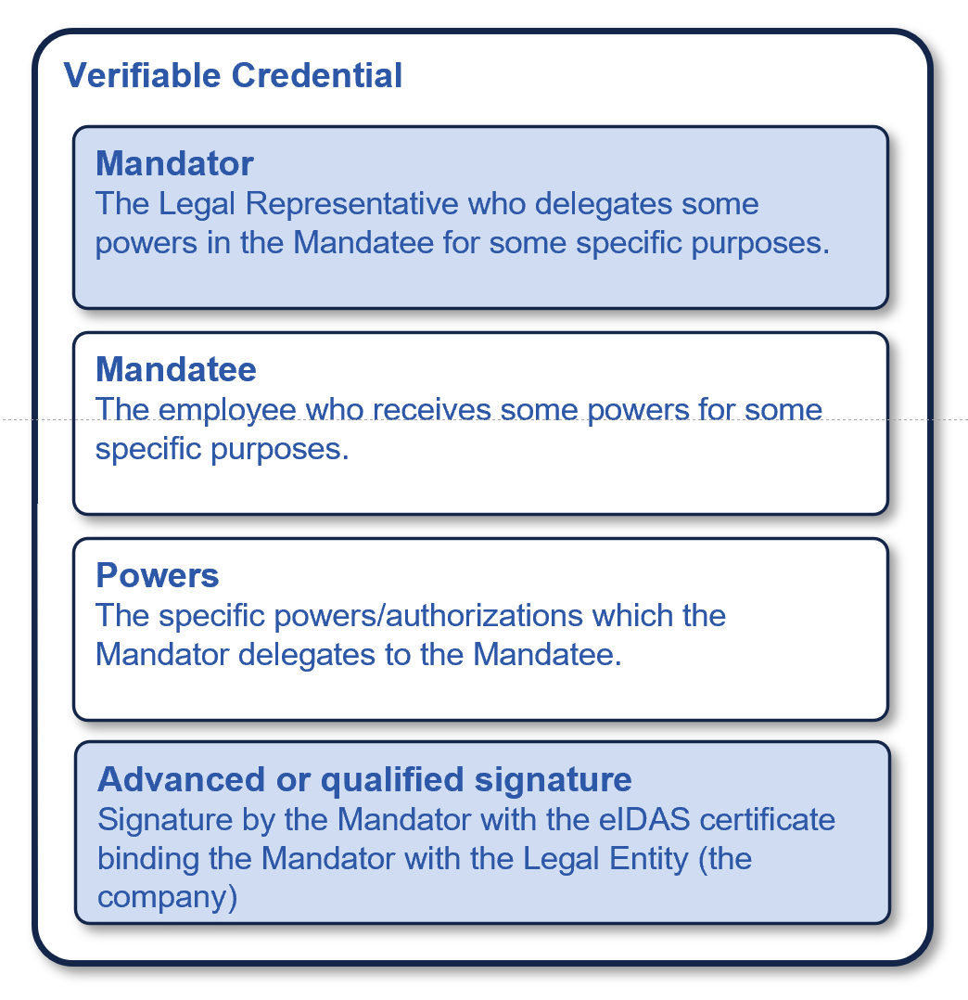

# Onboarding in ISBE - Identity of Organizations and of Employees of Organizations

The objectives of the onboarding process in ISBE include the following:

1. Verify the **real-world identity of the organization** which is onboarding in ISBE. In particular, we have to verify with a high degree of certainty that the organization has an establishment in a country in the EU, and so that it is subject to the EU regulations.

2. Verify the **real-world identity of the legal representative** of the organization who signs the contractual agreements related to the onboarding in ISBE.

3. Determine a **unique identifier for the organization**, which will be used later for any relevant activity of the organization in the ISBE ecosystem.

4. Eventually, assign an **identity to one or more employees of the organization** to enable them to act on behalf of the organization in relation to ISBE and other entities in the ecosystem. This is typically required in organizations where the legal representative is not going to be involved in the daily operations and tasks in ISBE.

The most efficient way to achieve objectives 1, 2 and 3 is with an **eIDAS certificate of representation**, especially in Spain where those certificates have a wide adoption.

Objective 4 is achieved by issuing a Verifiable Credential to one or more employees, as a (Qualified) Electronic Attestation of Attributes, or (Q)EAA, **attesting that the legal representative of the organization has delegated a given set of powers to the employee** holding the VC.

This Verifiable Credential can be issued as a subproduct of the onboarding process and can fulfil two purposes at the same time:

- As an authentication mechanism for the employee, serving as the digital identity of that employee in ISBE and with other participants.

- As a mandate, proving that the employee has been authorized by the organization (strictly speaking, by a legal representative of the organization) to perform specific activities on behalf of the organization.

The rest of this document elaborates on the concrete mechanisms used to achieve the objectives.

# Identifier of the Organizations

Instead of inventing identifiers which are specific to ISBE, it makes sense to use an approach very similar (if not identical) to the one used in the EUDI Wallet ecosystem for onboarding and registering wallet-relying parties: during onboarding we require one or more **identifiers of the organization, as stated in an official record** together with identification data of that official record, expressed as one of the following:

- a value-added tax (‘VAT’) registration number;

- an economic operators registration and identification (‘EORI’) number as referred to in Commission Implementing Regulation (EU) No 1352/2013 (1);

- a legal entity identifier (‘LEI’) as referred to in Commission Implementing Regulation (EU) 2022/1860 (2);

- an European unique identifier (‘EUID’) as referred to in Commission Implementing Regulation (EU) 2021/1042 (4);

- an excise number as referred to in Article 2(12) of Council Regulation (EU) No 389/2012 (3);

- a registration number as registered in a national business register recognized at EU level.

This is easily achieved by requiring that organizations use an **eIDAS certificate of representation or a certificate for seals**, issued by a Qualified Trust Service Provider (**QTSP**). These are the certificates typically used to electronically sign contracts or electronic invoices, so **this is "business as usual" for the Spanish organizations**.

The key idea here is that the X.509 certificate issued by QTSPs already includes, by regulation, an attribute named `organizationIdentifier` which **already contains one of those unique official identifiers** mentioned above. We do not care which identifier is actually used, as long as it is unique. However, in Spain the identifier is almost always the TAX identifier (this is so for the private sector organizations).

This identifier is standardized in [ETSI EN 319 412-1 V1.6.1 (2025-06)](https://www.etsi.org/deliver/etsi_en/319400_319499/31941201/01.06.01_60/en_31941201v010601p.pdf), specifically in section *"5.1.4 Legal person semantics identifier"*.

When such a certificate is used by an organization to login or to sign/seal a document, the unique identifier is provided automatically in a secure and automated way because it is included in the certifi5cate used by the organization in the respective operation (login or signature/seal).

> [!IMPORTANT]
> 
> The proposal is that **onboarding in ISBE requires the use of an eIDAS certificate issued to the organization willing to onboard, and that the identifier of the organization in ISBE is the one included (by regulation) inside that certificate**.
> 
> We do not have to "invent" or create new identifiers of organizations. We just use the existing unique official identifiers that organizations already have, and that are used when they electronically sign legal documents like contracts or invoices.

## Comparison to other options

Using the existing official identifier inside an eIDAS certificate issued by a QTSP to the organization is superior to other options, like "inventing" a new identifier in ISBE (by some centralised governance entity), or letting the organizations "invent" a new identifier of their choosing:

- The official identifiers are assigned by regulated entities in all Member States, as soon as an organization is created or starts operating in some specific area of activity. We do not need to stablish a process for creating new identifiers, because they already exist and they have official recognition.

- If we created new identifiers (either centrally by ISBE or by each organization themselves), we would have to perform a costly validation process to make sure that the new identifier is assigned to the real-world organization. With the proposed approach we avoid th verification because it is already done by the QTSP that issued the certificate for signature/seal to the organization, as part of the process of including an official identifier inside the certificate. This process has a level of assurance (LoA) High, something that ISBE can not achieve (unless ISBE itself is a QTSP, of course).

- In addition, creating new identifiers and performing validation in ISBE limits the usage of the identifiers to ISBE. Using the official identifiers which already have cross-border recognition in the EU is a much better option enabling wider interoperability.

In particular, using the proposed identifiers is superior to the mechanism used in EBSI, for the reasons just described.

# Verification of the real-world identity of the Organization

When using an eIDAS certificate for the onboarding process (either a certificate of representation or a certificate for seals), the verification of the identity of the organization comes for free and with a LoA (level of assurance) which is substantial or high depending on whether an advanced or qualified electronic signature was used.

This is because the verification has been already performed by the QTSP which issued the certificate to the organization. For examples, see section *"3.2 Validación inicial de la identidad"* in ['Declaración de prácticas de certificación de DIGITELTS'](https://pki.digitelts.es/dpc/DIGITELTS_DPC.v2.1.pdf) or section *"3.2 Validación inicial de la identidad"* in ['Declaración de Prácticas de Confianza de LOGALTY para los servicios de certificación y de sellado de tiempo electrónico'](https://www.logalty.com/certificateauthority/dpc/LGT_DPC-PKI_v2r5_fdo.pdf).

When in ISBE we receive a document (in PDF, XML or JSON format) signed/sealed with an advanced or qualified signature using such eIDAS certificates, and the signature verification is successful, we **obtain for free the verification of the real identity of the organization**, leveraging on the verifications performed by the QTSPs on certificate issuance.

In addition, we also obtain a **unique official identifier of the organization which is cryptographically bound to the document being signed by the organization**. We only have to include the `organizationIdentifier` attribute in all relevant documents signed by the organization, and on verification of the signature, verify that the `organizationIdentifier`in the document being signed is the same as the `organizationIdentifier` included inside the certificate issued by the QTSP to the organization.

> [!IMPORTANT]
> 
> The proposal is to use the eIDAS certificate issued to the organization by a QTSP and rely on the verifications performed by the QTSP regarding the real identity of the organization, and also the relationship of the unique identifier with the identity of the organization.
> 
> Additionally, we can use this verification to check that the organization has an establishment legally recognized in a country of the EU, as the certificate includes the country code.

# Verification of the identity of the legal representative

In ISBE, we require the verification of the legal representative of the organization, to provide a high level of legal certainty to the relationship.

In the previous sections about identifiers of organizations and verification of their real-world identity, we said that we can use either a certificate of representation or a certificate for seals.

While this is true, for a secure and efficient verification of the legal representative, it is preferred to use a certificate of representation, which is the one typically used by legal representatives to electronically sign contracts and many other legally-binding documents.

This is because the QTSPs include in the certificate not only the unique official identifier of the organization, but also the identification of the legal representative, matching the official records of the organization and after verification that the natural person has the required powers of representation.

If the organization wants to use a certificate for seals, ISBE would have to require documentation about the legal representative and perform manual (and cumbersome) verification processes of that documentation. Alternatively, ISBE would have to assume a certain level of risk that would not exist with a certificate of representation.

> [!IMPORTANT]
> 
> The proposal is to require a certificate of representation to sign the contractual agreements with ISBE. Only in the case that this is not possible, accept documents sealed with a certificate for seals, performing additional verifications of the identity of the legal representative.

# Identity of an employee acting on behalf of the organization

In most cases, an organization does not act by itself, but instead it is an employee of the organization the one interacting with third parties, where the employee is acting on behalf of the organization. For example, when an organization onboards in ISBE, or performs any other administrative task, it is an employee the one who performs the processes.

> [!Note]
> 
> In some other cases, there may be one or more machines, controlled by the organization, performing some automated work (e.g., calling APIs of third-parties). We will talk about identities of machines/workloads later in this document.

If the person performing the activities is the legal representative, we already have a secure and efficient mechanism to authenticate that person: using the certificate of representation described in the section above.

However, **in many organizations the legal representative can not be involved in the daily operations with ISBE (or with other parties)**. We need a mechanism to enable the legal representative of the organization to "nominate" or "appoint" an employee and delegate to that employee a defined set of powers enough for performing the activities in ISBE.

In the context of ISBE, we can achieve this with a document signed by the legal representative with the same certificate of representation used to sign the other contractual documents. The document has to explicitly appoint an employee to act on behalf of the organization, and if we trust on the legal representative, then we do not have to perform any verification on that employee.

The appointment document has to be submitted as part of the onboarding process, together with the other documents. 

After the onboarding process, ISBE will issue a Verifiable Credential to the appointed employee, which will be used by the employee to authenticate against the ISBE portal and any other entity willing to accept the credential as an authentication mechanism (because they trust on the process that ISBE uses to issue the Verifiable Credential).

We can say that the Verifiable Credential is the identity of the employee when acting on behalf of the organization. Even though it has been issued as part of the onboarding process in ISBE, it is not really limited to ISBE, because it is based on a document signed by the legal representative of the company, attesting that the person identified in the credential is an employee.

> [!IMPORTANT]
> 
> The proposal is to issue a Verifiable Credential to an employee, based on a document signed by a legal representative or the organization, with the same certificate of representation used to sign the other contractual documents in the onboarding process.

But we do not stop here: we want to enable more than one employee to be acting on behalf of the organization, where each employee may have different capabilities, as determined by the organization itself. For example, we want to enable the organization to appoint an employee of the finance department to be able to perform financial-related operations with third-parties (which we will call Relying Parties), and one or more employees of the IT department to perform the technically related operations (and not financial operations).

## Attaching specific authorizations to the identity of the employee

In other words, we want to enable the organization to appoint one or more employees, where each employee may have different authorizations for specific operations. When the employee is acting on behalf of the company, the employee must present to the Relying Party a document which states explicitly the types of operations that the organization has authorized the employee to perform.

This is typically done with a **mandate**, which can be be described as:

> A mandate is a bundle of one or more authorizations granted by an identified entity (the principal) to another identified entity (the agent) to perform well-defined actions with legal consequences in the name and for the account of the former. In general terms, mandates can be **unilateral** (unilaterally given by the principal), **contractual** (e.g. a mandate given to an accountant), **based on statutes** (e.g. a mandate of the CEO to represent a legal person), or **based on law** (e.g. a mandate of the parent to represent his/her child).

In the context of ISBE, we are concerned only with a type of contractual mandate, where **the legal representative appoints an employee and grants a very specific subset of powers, those required to interact with ISBE** or in the context of the ISBE ecosystem.

This mandate is just an agreement between parties (the legal representative, the employee, and ISBE), and does not require "official" recognition (e.g. by a notary or any regulated entity).

Typically, this is done with a PDF document which is signed by the legal representative and by the employee (to explicitly accept the granted powers), and is accepted by the third-party (ISBE and participants in ISBE, in this case).

However, the proposal is to use a Verifiable Credential to implement an electronic mandate, as a (Qualified) Electronic Attestation of Attributes.

> [!IMPORTANT]
> 
> The proposal is to use a Verifiable Credential to represent the identity of an employee acting on behalf of the organization.
> 
> The credential is signed by a legal representative of the organization, so we do not need any additional verification: 

## The mandate as a (Q)EAA

As in the PDF version, this Verifiable Credential is composed is composed of several related objects: `mandator`, `mandatee`, `power` and `signer`. The mandate is signed or sealed with an advanced or qualified signature or seal using an eIDAS certificate. Ideally, a certificate of representation is used for the signature of the mandate (the Verifiable Credential).

The following image represents the structure of such credential.

### Mandator

The mandator identifies the employee of the company who is delegating a subset of her powers on the mandatee.
The mandator is either:

- a **legal representative of the company**, according to the official records associated to the incorporation of the organisation (e.g., the business registry of the country of incorporation); or
- an employee who is a mandatee in another mandate where the mandator is a legal representative of the company. We do not support more than two levels of delegation.

The Mandator section includes always the identification of the organization, that is, the `organizationIdentifier`described in previous sections.

### Mandatee

The mandatee is the **person granted with the power to represent (and act as) the company in some specific actions with third-parties**. The powers granted to the mandatee must be a subset of the powers of the mandator. For example, an employee (the mandatee) can be empowered by the legal representative of the company (the mandator) to perform the onboarding process in ISBE.

  The object mandatee identifies the employee on whom a subset of powers is delegated. The mandatee object contains:

- A set of **attributes of the employee** (e.g. name, surname, email) which are required by the specific use case where the Verifiable Credential will be used. Those attributes can be considered equivalent to the fields that would be filled in a form when a "classical" PDF document would be used to authorise an employee.
- A **public key associated to the employee** and where the employee is the sole controller of the associated private key. This is required to enable the use of the Verifiable Credential containing the mandate as an efficient, scalable and secure **authentication and authorisation** mechanism. More on this later in this document.
  The private key controlled by the employee is used to prove to Relying parties receiving the Verifiable Credential that the holder and presenter of the credential is the same person identified in the mandatee object.

### Signer

The Signer is either the Mandator or a third-party that attests that the Mandator really delegated the powers to the Mandatee. The Signer is the entity that performs an advanced or qualified signature or seal using an eIDAS certificate.

The Signer is the entity that has to be trusted by the receiver of the Verifiable Credential.

### Powers

A list of each specific power that is delegated from the mandator to the mandatee. The powers must be concrete and as constrained as possible, and must follow a taxonomy with the semantics well specified.

In ISBE, we have to specify a power taxonomy targeted at the interactions we expect. This means that the actions are well defined, homogeneous and standardised for the ecosystem. We are basically replacing the current mechanisms for Mandates (e.g., paper or PDF) with a more efficient, machine-processable representation in the form of a Verifiable Credential.

Our Power Taxonomy could be generalised to other actions involving private sector companies, but it is out of scope of this version of the document.

## On the signature of the mandate

In ISBE we require that the electronic signature of the Verifiable Credential representing the mandate is performed in an equivalent way to its analogic counterpart (the PDF document): it has to be signed with an **advanced or qualified signature using a qualified certificate for electronic signature issued to a legal representative or the organisation** (what we call a certificate of representation).

In this way, the Verifiable Credential has the same level of legal assurance as the equivalent PDF, but it is much more efficient to verify: the PDF requires manual verification of the text in it, while the verification of the credential can be automated thanks to its machine-readable format.

That means that the Verifiable Credential can be used everywhere the PDF is used, with the same level of risk and legal certainty, but the processing can be instantaneous, compared to the typical longer processing times of a PDF-based process.
