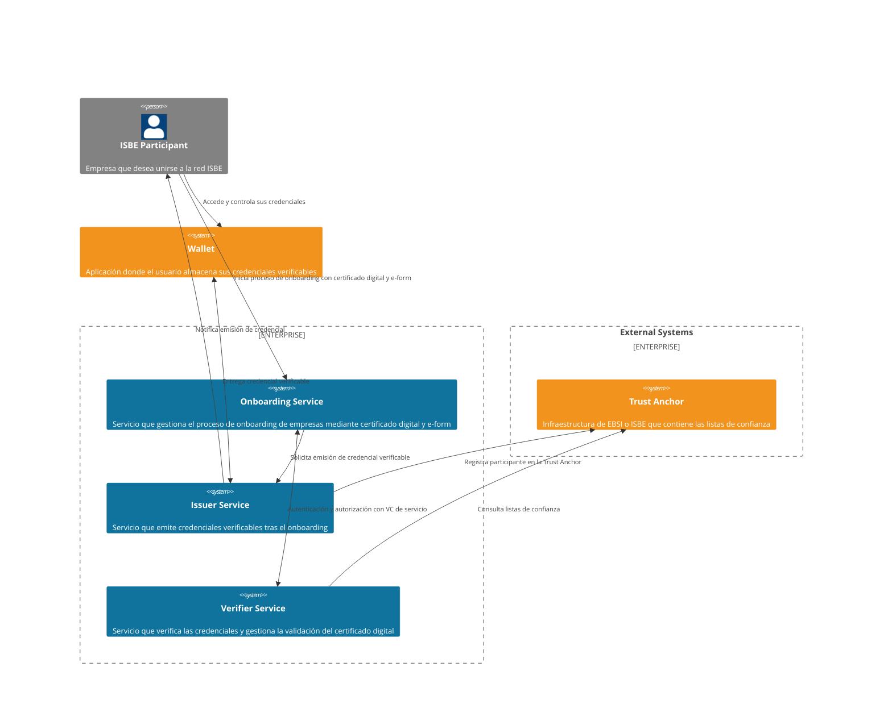
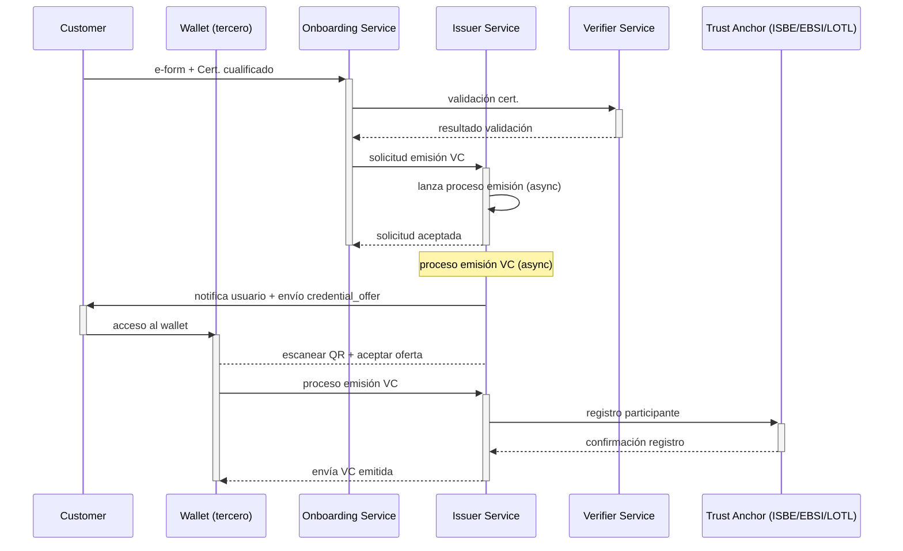

# ISBE-ARTIFACT-04010 - Onboarding de empresas a ISBE

## **1. Identificación del Artefacto**

| Campo                     | Valor                                                                                                                                                                                           |
|---------------------------|-------------------------------------------------------------------------------------------------------------------------------------------------------------------------------------------------|
| **Nombre del artefacto**  | ISBE-ART-04010 — Onboarding de empresas a ISBE                                                                                                                                                  |
| **Origen**                | Solución que permite a las empresas poseedoras de un certificado digital realizar el onboarding en ISBE de manera self-service y obtener una credencial verificable como resultado del proceso. |
| **Estado**                | *En desarrollo*                                                                                                                                                                                 |
| **Versión del documento** | *0.1.0*                                                                                                                                                                                         |
| **Fecha**                 | *2025-09-09*                                                                                                                                                                                    |
| **Repositorio**           | [https://github.com/alastria/isbe-gobernanza-onboarding](https://github.com/alastria/isbe-gobernanza-onboarding)                                                                                |
| **Commit**                | N/A                                                                                                                                                                                             |

## **2. Propósito del Artefacto**

- **Objetivo funcional:** Facilitar el registro y acceso de empresas en ISBE mediante un flujo de alta completamente digital, utilizando certificados digitales cualificados. El sistema valida el certificado presentado, permite completar un formulario de datos básicos y emite una credencial verificable.

- **Beneficio para ISBE:** Asegura un onboarding ágil, estandarizado y conforme a normativa para empresas, reduciendo costes de verificación manual y garantizando interoperabilidad con el ecosistema europeo (EBSI).

- **Stakeholders clave:**  
  - **Equipos técnicos ISBE**: desarrollo, despliegue e integración de la solución, 
  - **Empresas usuarias**: identificación simplificada y acceso a ISBE. 
  - **Reguladores y auditores**: cumplimiento de normativa eIDAS2 y GDPR. 
  - **Otros proveedores**: integraciones con Trust Anchor y Wallet externos.

## **3. Alcance y Ciclo de Vida**

- **Fases cubiertas:**

  - 🟡 **Planificación:** acotar alcance, dependencias externas y plan de entregas. [Plan de proyecto](../proyecto/PLAN_DE_PROYECTO.md) 
  
  - 🟡 **Análisis:** convertir el alcance en requisitos verificables y contratos funcionales. [Documento Técnico](../proyecto/DOCUMENTO_TECNICO.md)
  
  - 🟡 **Diseño:** diseñar componentes, interfaces y seguridad end-to-end. [Documento de Diseño](../proyecto/DOCUMENTO_DISE%C3%91O.md) 
  
  - 🟡 **Implementación:** construir y configurar los componentes comprometidos.
  
  - 🟡 **Pruebas:** asegurar conformidad funcional, interoperabilidad y NFR. [Plan de pruebas](../proyecto/PLAN_DE_PRUEBAS.md)
  
  - 🟡 **Despliegue:** poner el servicio en PRD de forma segura y replicable. [Plan de despliegue](../proyecto/PLAN_DE_DESPLIEGUE.md)
  
  - 🟡 **Mantenimiento:** asegurar continuidad operativa, cumplimiento y evolución. [Plan de mantenimiento](../proyecto/PLAN_DE_MANTENIMIENTO.md)
  
  > NOTA: El artefacto cubre el ciclo completo siguiendo la metodología de desarrollo ágil (Software Development Life Cycle - SDLC) y DevOps, garantizando entregas iterativas y mejora continua.

- **Dependencias**:

  - **Trust Anchor**: sistema externo que mantiene las listas de confianza (EBSI/ISBE).
  > NOTA: La disponibilidad y conformidad del Trust Anchor es crítica para la validación de certificados y registro de participantes. Aún no se ha definido el proveedor concreto.
  
  - **Wallet**: sistema externo donde el usuario final almacena y gestiona sus credenciales verificables.
  > NOTA: La solución no incluye la provisión ni gestión de Wallets, pero depende de su disponibilidad y conformidad con estándares OID4VCI/OID4VP.

  - **Servicio de firma remoto**: sistema externo para la firma digital y su validación.
  > NOTA: Dentro del proyecto ISBE este servicio es provisto por un tercero (DIGITEL TS) y es crítico para la firma de credenciales verificables.
  
- **Mantenimiento:**

  - Actualización periódica de librerías de validación de certificados dentro del contrato de mantenimiento de servicio que se establezca al finalizar el proyecto y su periodo de garantía.
  
  - Evolución del Issuer/Verifier en función de nuevas releases de protocolos OIDC4VCI / OID4VP. Estos componentes son open source y es responsabilidad del equipo de operaciones del proyecto el mantenerlos actualizados más allá del periodo de garantía.
  
  - Cualquier ampliación o cambio en los flujos de onboarding deberá ser evaluado y planificado como parte del contrato de mantenimiento.
  
  > NOTA: El mantenimiento del artefacto se realizará conforme al Plan de mantenimiento y puede consultarse [aquí](../proyecto/PLAN_DE_MANTENIMIENTO.md).

## **4. Definición del Artefacto**

- **4.1. Artefacto de arquitectura de referencia:**

[//]: # ([Diagrama] Documento maestro o plano arquitectónico que le da origen a alto nivel.)

El artefacto **ISBE-ARTIFACT-04010** se fundamenta en una arquitectura de referencia de identidad digital distribuida, en la que el proceso de onboarding de empresas se articula en torno a tres componentes principales provistos por nuestro equipo: **Onboarding Service**, **Issuer Service** y **Verifier Service**.

El diagrama de nivel 2 (C4) representa la interacción entre dichos componentes, los participantes externos y las infraestructuras de confianza:

- **ISBE Participant (Empresa)**: el actor que inicia el proceso presentando su certificado digital cualificado y completando el e-form de registro. 
- **Onboarding Service**: gestiona el flujo de alta, valida la información proporcionada y orquesta las interacciones con el Issuer y el Verifier.
- **Issuer Service**: emite la credencial verificable (**LEARCredentialEmployee**) del LEAR de la empresa registrada en ISBE tras la validación exitosa del certificado y los datos. También registra al nuevo participante en la red de confianza (Trust Anchor). 
- **Verifier Service**: valida certificados digitales y credenciales verificables, asegurando que las empresas y servicios que acceden o participan del ecosistema lo hacen con atributos auténticos y vigentes.
- **Wallet *(externo)***: aplicación en la que el usuario recibe, almacena y gestiona la credencial emitida. Este componente no es provisto por nuestro equipo, pero es esencial para la custodia y el uso posterior de la credencial.
- **Trust Anchor (EBSI/ISBE/LOTL)**: infraestructura externa que mantiene las listas de confianza y entidades válidas. El Issuer y el Verifier dependen de este servicio para realizar la validación y el registro de nuevos participantes.

La arquitectura refleja el paradigma descentralizado de identidad digital:
- El Trust Anchor actúa como fuente de confianza común. 
- El Issuer otorga credenciales verificables tras el onboarding. 
- El Verifier garantiza la validez de los atributos presentados en procesos M2M. 
- El Wallet asegura la soberanía del participante sobre sus credenciales. 

> NOTA: Esta arquitectura permite cumplir con los principios de interoperabilidad (**OID4VCI** y **OID4VP**), alineamiento con **eIDAS2** y resiliencia en un contexto federado, donde cada componente puede evolucionar o ser operado por diferentes entidades sin comprometer el flujo global.

Diagrama C4-Level 2:

- **4.2. Trazabilidad:**

[//]: # (Mapeo con la arquitectura y requisitos funcionales/no funcionales.)

**Requisitos funcionales**

- **Creación de una nueva cuenta**: los usuarios deben poder crear una cuenta en el sistema proporcionando un certificado digital cualificado y completando un formulario electrónico (e-form) con sus datos básicos.

    - **Consentimiento informado**: el sistema debe presentar los términos y condiciones, así como la política de privacidad, y registrar el consentimiento del usuario con un sello de tiempo.
    - **Captura de datos mediante e-form**: el sistema debe proporcionar un e-form accesible y multilingüe (ES/EN) para que el usuario ingrese los datos necesarios para el registro de la empresa en ISBE, con validación de campos tanto en cliente como en servidor.

- **Validación del certificado digital**: el sistema debe validar la autenticidad y vigencia del certificado digital presentado por el usuario, incluyendo la verificación de la firma y la cadena de confianza.

    - **Validación de certificado digital**: el sistema debe validar la autenticidad y vigencia del certificado digital contra las listas de confianza de la Unión Europea recopiladas en la Lists of Trusted Lists (LOTL).

- **Emisión de credencial verificable**: tras la validación exitosa del certificado y los datos del e-form, el sistema debe emitir una credencial verificable conforme a OID4VCI que contenga los atributos necesarios para identificar a la empresa en ISBE.

    - **Autenticación del servicio emisor**: el sistema debe autenticarse antes de realizar la petición de emisión de credencial utilizando una LEARCredentialMachine de servicio con permisos adecuados con el Verifier.
    - **Notificación de inicio de emisión**: el sistema debe notificar al usuario el inicio del proceso de emisión vía envío de la `credential_offer` por correo electrónico.
    - **Firma de la credencial**: el sistema debe firmar la credencial utilizando un certificado digital cualificado emitido por un Prestador de Servicios de Confianza (QTSP) reconocido. El emisor del proyecto debe ser ISBE o Alastria.

- **Registro en la red de confianza**: el sistema debe registrar a la nueva empresa como participante válido en la red de confianza (Trust Anchor) de ISBE/EBSI.

    - **Registro del Issuer en Trust Anchor**: el sistema de emisión debe estar registrado como emisor autorizado en el Trust Anchor (ISBE/EBSI) para poder emitir credenciales verificables.
    - **Integración con Trust Anchor**: el sistema debe integrarse con el Trust Anchor para registrar a la nueva empresa como participante válido tras la emisión de la credencial.

- **Revocación de la credencial**: el sistema debe permitir la revocación de la credencial verificable.

    - **Revocación basada en SD-JWT**: dado que el sistema utiliza SD-JWT para la emisión de credenciales, debe implementar el mecanismo de revocación definido para invalidar la credencial en caso de ser necesario.

**Requisitos no funcionales (NFR)**

- **Seguridad**: el sistema debe garantizar la seguridad de los datos en tránsito y en reposo, utilizando protocolos de cifrado adecuados (TLS 1.2+ para datos en tránsito y AES-256 para datos en reposo). Además, debe implementar mecanismos robustos de autenticación y autorización entre los servicios (OAuth2.0, JWT).
- **Usabilidad**: la interfaz del e-form debe ser intuitiva, accesible (cumpliendo WCAG 2.1 AA), multilingüe (ES/EN) y responsive para facilitar su uso en diferentes dispositivos.
- **Interoperabilidad**: el sistema debe estar alineado con los estándares OID4VCI (emisión) y OID4VP (presentación) para garantizar la interoperabilidad con otros sistemas y servicios del ecosistema europeo.
- **Privacidad**: el sistema debe cumplir con el RGPD mediante la minimización de datos y permitir al participante controlar sus datos personales.
- **Disponibilidad y rendimiento**: el sistema debe ser capaz de validar certificados digitales en menos de 2 segundos y garantizar un uptime del 99.5% en los servicios críticos.

- **4.3. Descripción funcional detallada:**

[//]: # (Flujos de datos, casos de uso, escenarios cubiertos.)

**Flujos de datos**

1. **Usuario → Onboarding Service**
   - Datos enviados: Certificado digital cualificado + datos del e-form.
   
2. **Onboarding Service → Verifier Service**
    - Datos enviados: Certificado digital para validación criptográfica contra listas de confianza (LOTL).
   
3. **Onboarding Service → Servicio de firma (TSA / Consentimiento GDPR)**
   - Datos enviados: Evidencia de aceptación de condiciones y consentimiento.
   
4. **Onboarding Service → Issuer Service**
   - Datos enviados: Datos verificados del e-form y resultado de validación del certificado.
   
5. **Issuer Service → Servicio de firma digital**
   - Datos enviados: Digest de la credencial para firma conforme a JOSE/JWT.
   
6. **Issuer Service → Wallet del usuario**
   - Datos enviados: Oferta de credencial (credential_offer) y, tras la aceptación, la credencial verificable emitida.
   
7. **Issuer Service → Trust Anchor (ISBE/EBSI)**
   - Datos enviados: Registro de la empresa como participante confiable en la red.

**Casos de uso**

- **CU-01**. Onboarding self-service de empresa: Alta autónoma en ISBE mediante certificado digital.

- **CU-02**. Validación de certificado cualificado: Comprobación criptográfica y listas de confianza (LOTL).

- **CU-03**. Emisión de credencial verificable de empresa: Generación conforme a OIDC4VCI.

- **CU-04**. Registro en red de confianza: Alta del participante en Trust Anchor ISBE/EBSI.

- **CU-05**. Custodia de credenciales: Delegado a Wallet externo gestionado por la empresa.

**Escenarios cubiertos**

- **Escenario A**: Onboarding exitoso (Happy Path)
    - El certificado proporcionado es válido y no está revocado.
    - El usuario completa el e-form con datos correctos.
    - El sistema valida el certificado y los datos.
    - El sistema registra la conformidad del usuario (GDPR).
    - El Issuer emite la credencial verificable.
    - El usuario recibe la `credential_offer` y acepta.
    - La credencial se entrega al Wallet del usuario.
    - El Issuer registra a la empresa en la red de confianza (Trust Anchor).
    - La empresa puede utilizar la credencial para acceder a servicios en ISBE.

- **Escenario B**: Certificado inválido o revocado
    - El usuario presenta un certificado que ha sido revocado o no es válido.
    - El sistema intenta validar el certificado.
    - El sistema detecta que el certificado no es válido (revocado, expirado, no emitido por QTSP reconocido).
    - El sistema notifica vía email (proporcionado en el e-form) al usuario del error y no permite continuar con el onboarding.
    - El proceso de onboarding se detiene y no se emite ninguna credencial.
    - Los datos del e-form no se almacenan.

- **Escenario C**: Error durante el proceso de tratamiento de datos del e-form
    - El usuario completa el e-form, pero ocurre un error técnico (p. ej., fallo en la base de datos, fallo en el TSA de la conformidad del GDPR, error en alguno de los datos informados en el e-form, etc.).
    - El sistema detecta el error durante el procesamiento de los datos.
    - El sistema notifica al usuario del error y le solicita que intente nuevamente.
    - El proceso de onboarding se detiene y no se emite ninguna credencial.
    - Los datos del e-form no se almacenan.

[//]: # (TODO: Revisar si el proceso definido para este escenario es el correcto.)

- **Escenario D**: Error durante la emisión de la credencial
    - El usuario ha completado el e-form y el certificado es válido, pero ocurre un error técnico durante la emisión de la credencial (p. ej., fallo en la comunicación con el Issuer, error en la firma digital, etc.).
    - El sistema detecta el error durante el proceso de emisión.
    - El sistema notifica al usuario del error y le solicita que intente nuevamente.
    - En el supuesto que el error sea debido a un fallo en la comunicación con el sistema de firma digital, se reintentará la operación hasta un máximo de 3 veces antes de notificar el error al operador de la solución el cual deberá revisar el estado del sistema de firma digital, resolver el problema y reintentar la operación manualmente.
    - El proceso de onboarding se detiene y no se emite ninguna credencial.
    - Los datos del e-form se almacenan de forma segura y se establece el estado del proceso como "pendiente de firma".

- **4.4. Modelos o diagramas específicos:**

[//]: # (Diagrama de componentes, interfaces, secuencias, flujos.)

**Diagrama de secuencia del proceso de onboarding**

- **4.5. Reglas de negocio asociadas:**

[//]: # (Validaciones, restricciones operativas.)

**Identificación y elegibilidad**

- **RB-01. Certificado cualificado obligatorio**: solo se admite onboarding con certificado cualificado emitido por QTSP reconocido en LOTL/Trust Anchor. 
- **RB-02. No proxies**: el certificado debe pertenecer a la persona que actúa en nombre de la empresa (representante/LEAR); no se aceptan certificados de terceros sin poder de representación.
- **RB-03. Un LEAR activo por empresa**: cada empresa puede tener 1 LEARCredentialEmployee activa simultáneamente; la emisión de una nueva implica la revocación o caducidad de la anterior.

- **RB-04. Emparejamiento empresa-certificado**: debe validarse la relación entre NIF/CIF de la empresa y el sujeto/atributos del certificado o documentación aportada (según políticas ISBE).

**Consentimiento y tratamiento de datos**

- **RB-05. Consentimiento expreso**: el onboarding requiere aceptación de T&C y Política de Privacidad. Se registra hash de versión, IP, timestamp y evidencia de pantalla (TSA opcional).

- **RB-06. Minimización**: el e-form únicamente solicita datos estrictamente necesarios para Identidad y alta en Trust Anchor.

- **RB-07. Retención**: evidencias de consentimiento y logs de auditoría se conservan por el período legal mínimo y/o el definido por ISBE.

**Validación criptográfica y listas de confianza**

- **RB-08. Cadenas válidas**: el Verifier debe construir y validar cadena hasta CA/Trust Anchor admitida; si cualquier eslabón es inválido o revocado → rechazo.

- **RB-09. Revocación en origen**: comprobación en CRL/OCSP (o mecanismo equivalente provisto por el Trust Anchor/EBSI/ISBE).

- **RB-10. Frescura de listas**: la caché de LOTL/TL debe respetar TTL/ETag; al expirar, la validación se bloquea hasta refresco correcto o se entra en modo degradado definido por política.

**Emisión y registro**

- **RB-11. Autenticación del emisor**: el Issuer solo puede emitir si presenta credencial de máquina (service VC) válida y con scopes/powers adecuados verificados por el Verifier.

- **RB-12. Oferta previa**: antes de emitir, se envía credential_offer al Wallet del usuario; la emisión requiere aceptación explícita desde el Wallet.

- **RB-13. Firma cualificada**: la VC se firma utilizando material y políticas de firma definidas (QTSP/servicio de firma remoto).

- **RB-14. Registro en Trust Anchor**: la empresa queda dada de alta como participante tras emisión satisfactoria; si el registro falla, la emisión queda pendiente hasta completar.

**Revocación y ciclo de vida**

- **RB-15. Causas de revocación**: renuncia del LEAR, cese de representación, fraude, orden de autoridad ISBE, baja de empresa o caducidad.

- **RB-16. Efecto inmediato**: la revocación debe reflejarse en el estado consultable por relying parties y Wallets en un tiempo objetivo ≤ 5 min.

- **RB-17. Sustitución controlada**: la emisión de nueva credencial para el mismo set de datos debe disparar la revocación de la anterior.

**Resiliencia operativa**

- **RB-18. Idempotencia**: todas las operaciones clave (validación, solicitud de emisión, registro) deben ser idempotentes mediante transaction_id.

- **RB-19. Reintentos acotados**: ante fallos transitorios del servicio de firma o Trust Anchor, se aplican reintentos exponenciales (p. ej., 3 intentos).

- **RB-20. Estados del proceso de emisión**: DRAFT → ISSUED (*error PEND_SIGNATURE) → VALID → REVOKED / EXPIRED.

- **4.6. Interfaces y puntos de integración:**

[//]: # (APIs, endpoints, eventos, contratos de datos.)
[//]: # (Interfaces públicas)

Esta sección define las **API públicas**, **endpoints expuestos**, **eventos** y **contratos de datos** que permiten la integración del artefacto de Onboarding de Empresas con otros componentes del ecosistema ISBE y con servicios externos.

Se diferencian los puntos de integración en función del componente: 
**Onboarding Service**, **Issuer Service** y **Verifier Service**. 
* Los endpoints se alinean con las especificaciones **OIDC**, **OID4VCI** y **OID4VP**, siguiendo las convenciones establecidas en el documento de referencia DOME.

**Onboarding Service**

**Responsabilidad**: Orquesta el proceso de alta de empresa, recogida de datos y validación de certificado. 

- POST `/onboarding/v1/register` 
  - **Descripción**: Inicia el proceso de registro enviando certificado digital y datos del e-form. 
  - **Entrada**: multipart/form-data con certificado (X.509) y JSON con atributos de empresa. 
  - **Salida**: transaction_id, estado inicial (INICIADO). 
  - **Errores**: 400 invalid_certificate, 500 internal_error.

- POST `/onboarding/v1/consent`
  - **Descripción**: Registra el consentimiento informado del usuario (GDPR). 
  - **Entrada**: JSON con hash de T&C, timestamp, ip_address. 
  - **Salida**: Evidencia registrada, consent_id.
  - **Eventos emitidos**:
    - OnboardingCompleted (con transaction_id, empresa, LEAR asignado). 
    - OnboardingFailed (con causa y trazabilidad).

**Issuer Service**

**Responsabilidad**: Emite credenciales verificables conforme a OID4VCI.

Endpoints alineados con [OID4VCI]:

- POST `/vci/v1/issuances`
  - **Descripción**: Acepta datos verificados del Onboarding para preparar emisión de credencial. 
  - **Entrada**: PreSubmittedCredentialDataRequest (JSON). 
  - **Salida**: 201 CREATED con issuance_id.

- GET `/oid4vci/v1/credential-offer/{id}`
  - **Descripción**: Devuelve objeto Credential Offer asociado al proceso. 
  - **Salida**: JSON con credential_issuer, credential_configuration_ids, grants. 

- POST `/oid4vci/v1/credential`
  - **Descripción**: Emite credencial verificable tras validación de token. 
  - **Entrada**: CredentialRequest (con credential_configuration_id y proofs). 
  - **Salida**: Credencial firmada en formato jwt_vc_json.

- POST `/oid4vci/v1/deferred-credential` 
  - **Descripción**: Recupera credencial emitida en modo diferido mediante transaction_id. 

- GET `/.well-known/openid-credential-issuer` 
  - **Descripción**: Metadatos del Issuer, incluyendo credenciales soportadas y algoritmos de firma.

- GET `/.well-known/openid-configuration` 
  - **Descripción**: Metadatos del servidor de autorización OAuth2 (RFC 8414).

- POST `/oauth/token` 
  - **Descripción**: Intercambia pre-authorized_code + tx_code por access_token.

**Verifier Service**

**Responsabilidad**: Validar certificados digitales y credenciales verificables (OID4VP).

Endpoints alineados con [OID4VP]:

- GET `/authorize` 
  - **Descripción**: Inicio de flujo de autenticación (OIDC Authorization Code Flow). 
  - **Parámetros**: client_id, request_uri, state, nonce.

- GET `/oid4vp/v1/auth-request/{id}` 
  - **Descripción**: Recupera objeto Authorization Request firmado.

- POST `/oid4vp/v1/auth-response`
  - **Descripción**: Procesa Authorization Response enviada por el Wallet. 
  - **Entrada**: vp_token (VC presentadas). 
  - **Salida**: 200 OK si la validación es correcta.

- POST `/oauth/token`
  - **Descripción**: Intercambia authorization_code por access_token e id_token. 

- GET `/did-resolver/{did}`
  - **Descripción**: Resuelve did:key a JWKS para validar firmas de presentaciones.

- **4.7. Normativas y requisitos regulatorios:**

[//]: # (RGPD, estándares específicos si aplican.)

> NOTA: Esta sección identifica marcos regulatorios y estándares de referencia. La conformidad detallada se verificará en el Plan de Cumplimiento y el Plan de Pruebas.

**Identidad y firmas electrónicas**

- **eIDAS/eIDAS2**: marco regulatorio europeo para identificación electrónica y servicios de confianza.
- **ETSI EN 319 411-1/2** (requisitos para QTSP y certificados cualificados).
- **ETSI EN 319 412** (perfiles de certificados).
- **ETSI EN 319 421** (políticas para sellos de tiempo, si aplica TSA para evidencias).
- **Perímetro Trust Anchor/LOTL/TL**: uso de listas de confianza oficiales (EBSI/ISBE/UE).

**Credenciales verificables y protocolos**

- **W3C Verifiable Credentials (v2)**: modelo de datos de credenciales.
- **IETF SD-JWT (RFC 9068)**: credenciales con revelación selectiva.
- **OpenID for Verifiable Credential Issuance (OID4VCI)**: emisión interoperable.
- **OpenID for Verifiable Presentations (OID4VP)**: presentación/validación.
- **JWT/JWS/JWK (RFC 7515/7517/7519)** y perfiles asociados.
- Mecanismos de revocación acordes al formato de la credencial (p. ej., listas de estatus o mecanismos del perfil SD-JWT/VC cuando aplique).

**Protección de datos y seguridad**

- **GDPR/RGPD**: licitud del tratamiento (Art. 6), consentimiento (Art. 7), transparencia (Art. 13), minimización (Art. 5), seguridad (Art. 32), derecho ARCO+, registros de actividades (Art. 30), DPIA (Art. 35) cuando corresponda.
- **NIS2 (si aplica al operador)**: obligaciones de ciberseguridad y notificación de incidentes.
- **WCAG 2.1 AA**: accesibilidad del e-form/UI.
- **OWASP ASVS L2 / OWASP Top 10**: buenas prácticas de seguridad de aplicaciones.
- **ISO/IEC 27001** (referencial para gestión de seguridad de la información, si aplica en operación).

**Evidencias y auditoría**

- **Trazabilidad completa**: generación y custodia de evidencias de consentimiento, validación de certificado, emisión y registro (logs firmados/time-stamped).
- **Políticas de retención**: alineadas con GDPR y las políticas de ISBE para auditoría y portabilidad.

- **4.8. Criterios de calidad específicos:**

[//]: # (Rendimiento esperado, seguridad, usabilidad.)

> NOTA: Los siguientes criterios se medirán mediante KPI y pruebas automatizadas. Las cifras iniciales son objetivos de MVP y pueden ajustarse en iteraciones.

**Rendimiento y disponibilidad**

- **CQ-01. Validación de certificado**: p95 ≤ 2 s; p99 ≤ 4 s.

- **CQ-02. Emisión end-to-end (desde aceptación de oferta hasta VC en Wallet)**: p95 ≤ 60 s (excluyendo latencias externas no controlables del proveedor de firma/Wallet).

- **CQ-03. Registro en Trust Anchor**: p95 ≤ 15 s.

- **CQ-04. Disponibilidad**: 99,5% mensual en servicios críticos (Onboarding, Verifier, Issuer).

- **CQ-05. Capacidad**: ≥ 50 onboardings concurrentes sin degradación por encima de los SLO.

**Seguridad**

- **CQ-06. Cifrado**: TLS 1.2+ en tránsito; cifrado en reposo para PII. Prohibido TLS_RSA_* sin PFS.

- **CQ-07. Tokens**: expiración de access_token ≤ 15 min; refresh_token rotatorio si aplica; soporte para DPoP o mTLS en canales M2M sensibles.

- **CQ-08. Hardening**: seguridad de cabeceras HTTP, rate-limit y protección anti-abuso (p. ej., 10 req/s/IP con burst control).

- **CQ-09. Vulnerabilidades**: 0 High/Critical abiertas > 7 días; análisis SCA/SAST en CI obligatorio.

**Interoperabilidad y conformidad**

- **CQ-10. Conformance**: pasar suites de OID4VCI/OID4VP de referencia y pruebas de integración con al menos 1 Wallet externo y 1 Trust Anchor (ISBE/EBSI).

- **CQ-11. Formato y firma**: VC verificables por validador estándar (JWS/JWT) y verificadores de terceras partes.

- **CQ-12. Revocación**: actualización de estado visible para relying parties ≤ 5 min tras la orden.

**Usabilidad y accesibilidad**

- **CQ-13. Accesibilidad**: cumplimiento WCAG 2.1 AA verificado con auditoría manual + tooling.

- **CQ-14. Internacionalización**: ES/EN completos (UI, emails, errores) con fallback coherente.

- **CQ-15**. Tasa de finalización del onboarding (Happy Path) ≥ 90% en pruebas de usuario guiadas.

**Observabilidad y auditoría**

- **CQ-16. Trazas**: 95% de transacciones críticas con trace_id (correlación) entre servicios.

- **CQ-17. Logs de auditoría**: inmutables, firmados o sellados en tiempo (si aplica), conservados según política.

- **CQ-18. Alertas**: MTTA ≤ 15 min, MTTR ≤ 2 h para incidentes de severidad alta.

**Resiliencia y recuperación**

- **CQ-19. Reintentos**: política exponencial (máx. 3) en llamadas a TSA/Firma/Trust Anchor; colas de compensación para retry later.

- **CQ-20. Backups**: RPO ≤ 24 h, RTO ≤ 4 h para datos persistentes no que no se puedan reconstruir.

- **CQ-21. Idempotencia**: repetición segura de operaciones con transaction_id sin efectos colaterales.

## **5. Desarrollo del Artefacto**

- **5.1. Componentes del artefacto:**

[//]: # (Lista de elementos clave producidos: código, scripts, configuraciones, manuales.)

- **Onboarding Service**: microservicio REST para gestionar el flujo de alta de empresas, validación de certificados y orquestación con Issuer y Verifier.
- **Issuer Service**: microservicio conforme a OID4VCI para emitir credenciales verificables tras validación.
- **Verifier Service**: microservicio conforme a OID4VP para validar certificados digitales y credenciales verificables.
- **Base de datos**: almacenamiento seguro de transacciones, estados y evidencias (PostgreSQL o similar).
- **Scripts de despliegue**: IaC (Terraform/Ansible) para provisión de infraestructura y despliegue automatizado.

- **5.2. Lista de elementos clave producidos: código, scripts, configuraciones, manuales:**

| Nombre | Descripción                     | Enlace                                                          |
|--------|---------------------------------|-----------------------------------------------------------------|
| Código | Repositorio GitHub - Onboarding | https://onboard.evidenceledger.eu/                              |
| Código | Repositorio GitHub - Issuer     | https://github.com/alastria/isbe-gobernanza-onboarding-issuer   |
| Código | Repositorio GitHub - Verifier   | https://github.com/alastria/isbe-gobernanza-onboarding-verifier |
| Manual | Documentación técnica completa  | https://github.com/alastria/isbe-gobernanza-onboarding          |

- **5.3. Frameworks, librerías o tecnologías acordadas:**

El desarrollo del artefacto se sustenta en un stack técnico basado en estándares abiertos y tecnologías consolidadas:

**Lenguaje y frameworks principales**

- **Backend**: Java (Spring Boot 3.x) / Go según componente.
- **Frontend**: HTML + JS para la interfaz del e-form de Onboarding.

**Protocolos y estándares**

- OIDC, OID4VCI, OID4VP, OAuth2.0, JWT/JWS/JWK. 
- W3C Verifiable Credentials v2, IETF SD_JWT, DID:key method v0.7. 
- Persistencia: PostgreSQL como base de datos relacional. 
- Seguridad y secretos: HashiCorp Vault para gestión de credenciales y llaves. 
- Infraestructura de despliegue: Docker, Docker Compose.

**Integraciones externas**

- QTSP Remote Signing Service (CSC v2.0).
- Trust Anchor ISBE/EBSI (TIR v4). 
- SMTP para notificaciones por correo. 
- Testing: JUnit 5, Postman, Sonarcloud.

- **5.4. Buenas prácticas aplicables:**

Se aplican lineamientos transversales en todas las fases de desarrollo y despliegue:

**Seguridad**
- TLS 1.2+ obligatorio, HTTPS everywhere.
- Tokens de acceso con expiración corta y refresco controlado.
- Revisiones periódicas con OWASP Top 10 y SAST/SCA en CI/CD.

**Rendimiento**

- Uso de cachés en memoria para LOTL/TL con TTL controlado.
- Validación de certificados ≤ 2s (p95).
- Monitorización de endpoints críticos con métricas de latencia y throughput.

**Mantenibilidad**

- Arquitectura modular con SPI plugins para esquemas, firma y trust anchors.
- Documentación de API en OpenAPI 3.0.
- Versionado semántico y etiquetado de releases.

- **5.5. Criterios de validación del desarrollo:**

[//]: # (Pruebas unitarias realizadas, auditorías, evidencias de funcionamiento.)

El artefacto se considera válido cuando cumple con:

- **Pruebas unitarias**: ≥ 80% de cobertura de código en componentes críticos. 
- **Pruebas de integración**: Ejecución contra Wallets externos y Trust Anchors de referencia. 
- **Pruebas de conformidad**: Pasar suites OID4VCI y OID4VP de interoperabilidad. 
- **Pruebas de rendimiento**: Validación de KPI definidos en criterios de calidad (latencias, concurrencia). 
- **Auditorías de seguridad**: Revisión de código estática (SAST), escaneo de dependencias (SCA), pentesting básico. 
- **Evidencias**: Logs de ejecución de pruebas, informes de auditoría, capturas de interoperabilidad.

- **5.6. Alineación con requisitos legales (GDPR, NIS2, etc.)**
    si aplica.

- **RGPD (UE 2016/679)**:
  - Base jurídica: consentimiento explícito registrado.
  - Minimización de datos en e-form. 
  - Derecho al olvido y portabilidad garantizados. 
  - Registro de actividad (Art. 30) y DPIA prevista para onboarding.
- **eIDAS2 (pendiente de aprobación definitiva)**:
  - Uso exclusivo de certificados cualificados y QTSP reconocidos. 
  - Registro en Trust Anchors europeos (EBSI/ISBE).
- **NIS2**:
  - Obligación de reporte de incidentes en caso de afectación a servicios críticos. 
  - Medidas de seguridad organizativas y técnicas (hardening, monitorización, backup).
- **Accesibilidad**: Cumplimiento de **WCAG 2.1 AA** en e-form.

- **5.7. Dependencias técnicas o de infraestructura:**

[//]: # (Sistemas, entornos, herramientas necesarias.)

- **Servicios internos**: Onboarding Service, Issuer Service, Verifier Service.
- **Servicios externos**:
  - QTSP remoto (firma CSC v2.0). 
  - Trust Anchor (EBSI/ISBE TIR v4). 
  - SMTP corporativo.
- **Entornos**:
  - DEV/STG/PRD en Arsys. 
  - CI/CD en GitHub Actions.
- **Herramientas**:
  - Terraform para IaC. 
  - Grafana/Prometheus para monitorización (iteración posterior).

- **5.8. Limitaciones temporales:**

[//]: # (MVP, iteraciones parciales, restricciones conocidas.)

- **MVP inicial**: centrado en flujo Happy Path (onboarding con certificado válido y credencial LEAR emitida) con formato W3C sin integración con EBSI/ISBE.

- **Iteraciones parciales**:
  - **Iteración 1**: Validación básica de certificado + e-form. 
  - **Iteración 2**: Integración con QTSP y emisión VC. 
  - **Iteración 3**: Registro Trust Anchor.
  
- **Restricciones conocidas**:
  - No incluye Wallet propio (se depende de externos). 
  - Observabilidad básica en MVP (logs + trazas). 
  - Revocación inicial manual o semi-automatizada.

- **5.9. Limitaciones por versiones, licencias o configuraciones.**

**Protocolos**:
- OID4VCI y OID4VP; sujetos a cambios en futuras ediciones.

**Dependencias de terceros**:
- QTSP externo puede cambiar SLA y API.
- Trust Anchor ISBE/EBSI sujeto a actualizaciones de versiones (EBSI v5).

**Licencias**:
- Software base open source bajo Apache 2.0, excepto dependencias propietarias (QTSP).

**Configuraciones**:
- Versiones mínimas soportadas: PostgreSQL 16+, Java 17+, Go 1.22+.
- Entorno Arsys con recursos limitados (no HA).

## **6. Reglas de Control y Actualización**

- Política de gestión de versiones para la fase de definición y desarrollo.
- Indicar si es actualizable tras la entrega, por quién y bajo qué condiciones.
- Frecuencia de revisión o actualizaciones planificadas.
- Herramienta de control de cambios: repositorio, SharePoint, wiki técnica, etc.

| Tipo de cambio  | Versionado | Flujo de aprobación        | Documentación requerida  |
|-----------------|------------|----------------------------|--------------------------|
| Evolutivo menor | X.Y+0.1    | Pull Request + revisión GT | Release notes detalladas |
| Evolutivo mayor | X+1.0      | Al Comité de ¿?            | Impacto                  |
