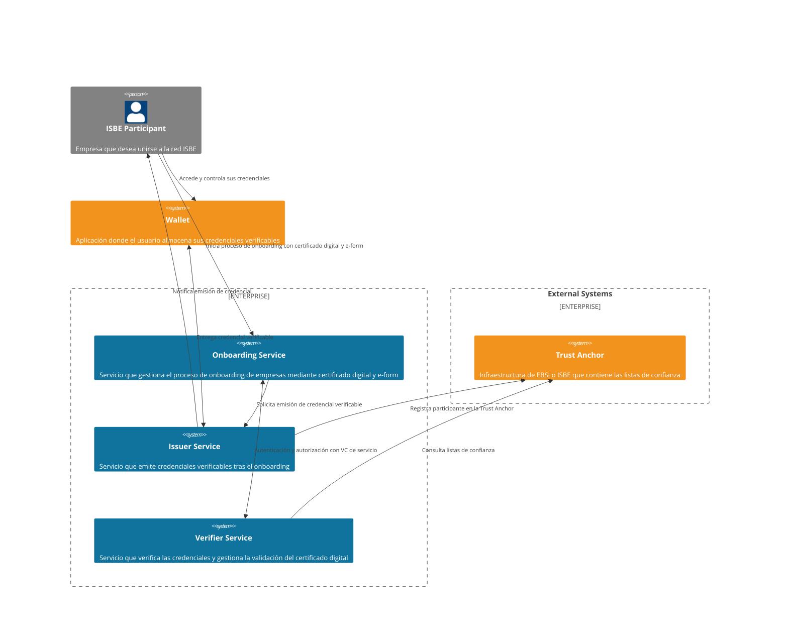
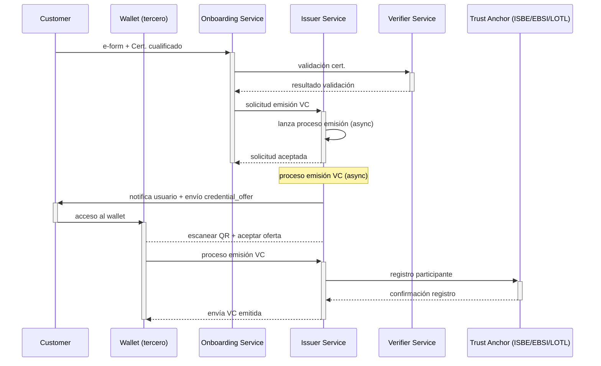

# ISBE-ARTIFACT-04010 - Onboarding de empresas a ISBE

## **1. Identificación del Artefacto**

| Campo                     | Valor                                                                                                                                                                                           |
|---------------------------|-------------------------------------------------------------------------------------------------------------------------------------------------------------------------------------------------|
| **Nombre del artefacto**  | ISBE-ART-04010 — Onboarding de empresas a ISBE                                                                                                                                                  |
| **Origen**                | Solución que permite a las empresas poseedoras de un certificado digital realizar el onboarding en ISBE de manera self-service y obtener una credencial verificable como resultado del proceso. |
| **Estado**                | *En desarrollo*                                                                                                                                                                                 |
| **Versión del documento** | *0.1.0*                                                                                                                                                                                         |
| **Fecha**                 | *2025-09-09*                                                                                                                                                                                    |
| **Repositorio**           | [https://github.com/alastria/isbe-gobernanza-onboarding](https://github.com/alastria/isbe-gobernanza-onboarding)                                                                                |
| **Commit**                | N/A                                                                                                                                                                                             |

## **2. Propósito del Artefacto**

- **Objetivo funcional:** Facilitar el registro y acceso de empresas en ISBE mediante un flujo de alta completamente digital, utilizando certificados digitales cualificados. El sistema valida el certificado presentado, permite completar un formulario de datos básicos y emite una credencial verificable.

- **Beneficio para ISBE:** Asegura un onboarding ágil, estandarizado y conforme a normativa para empresas, reduciendo costes de verificación manual y garantizando interoperabilidad con el ecosistema europeo (EBSI).

- **Stakeholders clave:**  
  - **Equipos técnicos ISBE**: desarrollo, despliegue e integración de la solución, 
  - **Empresas usuarias**: identificación simplificada y acceso a ISBE. 
  - **Reguladores y auditores**: cumplimiento de normativa eIDAS2 y GDPR. 
  - **Otros proveedores**: integraciones con Trust Anchor y Wallet externos.

## **3. Alcance y Ciclo de Vida**

- **Fases cubiertas:**

  - 🟡 **Planificación:** acotar alcance, dependencias externas y plan de entregas. [Plan de proyecto](../proyecto/PLAN_DE_PROYECTO.md) 
  
  - 🟡 **Análisis:** convertir el alcance en requisitos verificables y contratos funcionales. [Documento Técnico](../proyecto/DOCUMENTO_TECNICO.md)
  
  - 🟡 **Diseño:** diseñar componentes, interfaces y seguridad end-to-end. [Documento de Diseño](../proyecto/DOCUMENTO_DISE%C3%91O.md) 
  
  - 🟡 **Implementación:** construir y configurar los componentes comprometidos.
  
  - 🟡 **Pruebas:** asegurar conformidad funcional, interoperabilidad y NFR. [Plan de pruebas](../proyecto/PLAN_DE_PRUEBAS.md)
  
  - 🟡 **Despliegue:** poner el servicio en PRD de forma segura y replicable. [Plan de despliegue](../proyecto/PLAN_DE_DESPLIEGUE.md)
  
  - 🟡 **Mantenimiento:** asegurar continuidad operativa, cumplimiento y evolución. [Plan de mantenimiento](../proyecto/PLAN_DE_MANTENIMIENTO.md)
  
  > NOTA: El artefacto cubre el ciclo completo siguiendo la metodología de desarrollo ágil (Software Development Life Cycle - SDLC) y DevOps, garantizando entregas iterativas y mejora continua.

- **Dependencias**:

  - **Trust Anchor**: sistema externo que mantiene las listas de confianza (EBSI/ISBE).
  > NOTA: La disponibilidad y conformidad del Trust Anchor es crítica para la validación de certificados y registro de participantes. Aún no se ha definido el proveedor concreto.
  
  - **Wallet**: sistema externo donde el usuario final almacena y gestiona sus credenciales verificables.
  > NOTA: La solución no incluye la provisión ni gestión de Wallets, pero depende de su disponibilidad y conformidad con estándares OID4VCI/OID4VP.

  - **Servicio de firma remoto**: sistema externo para la firma digital y su validación.
  > NOTA: Dentro del proyecto ISBE este servicio es provisto por un tercero (DIGITEL TS) y es crítico para la firma de credenciales verificables.
  
- **Mantenimiento:**

  - Actualización periódica de librerías de validación de certificados dentro del contrato de mantenimiento de servicio que se establezca al finalizar el proyecto y su periodo de garantía.
  
  - Evolución del Issuer/Verifier en función de nuevas releases de protocolos OIDC4VCI / OID4VP. Estos componentes son open source y es responsabilidad del equipo de operaciones del proyecto el mantenerlos actualizados más allá del periodo de garantía.
  
  - Cualquier ampliación o cambio en los flujos de onboarding deberá ser evaluado y planificado como parte del contrato de mantenimiento.
  
  > NOTA: El mantenimiento del artefacto se realizará conforme al Plan de mantenimiento y puede consultarse [aquí](../proyecto/PLAN_DE_MANTENIMIENTO.md).

## **4. Definición del Artefacto**

- **4.1. Artefacto de arquitectura de referencia:**

[//]: # ([Diagrama] Documento maestro o plano arquitectónico que le da origen a alto nivel.)

El artefacto **ISBE-ARTIFACT-04010** se fundamenta en una arquitectura de referencia de identidad digital distribuida, en la que el proceso de onboarding de empresas se articula en torno a tres componentes principales provistos por nuestro equipo: **Onboarding Service**, **Issuer Service** y **Verifier Service**.

El diagrama de nivel 2 (C4) representa la interacción entre dichos componentes, los participantes externos y las infraestructuras de confianza:

- **ISBE Participant (Empresa)**: el actor que inicia el proceso presentando su certificado digital cualificado y completando el e-form de registro. 
- **Onboarding Service**: gestiona el flujo de alta, valida la información proporcionada y orquesta las interacciones con el Issuer y el Verifier.
- **Issuer Service**: emite la credencial verificable (**LEARCredentialEmployee**) del LEAR de la empresa registrada en ISBE tras la validación exitosa del certificado y los datos. También registra al nuevo participante en la red de confianza (Trust Anchor). 
- **Verifier Service**: valida certificados digitales y credenciales verificables, asegurando que las empresas y servicios que acceden o participan del ecosistema lo hacen con atributos auténticos y vigentes.
- **Wallet *(externo)***: aplicación en la que el usuario recibe, almacena y gestiona la credencial emitida. Este componente no es provisto por nuestro equipo, pero es esencial para la custodia y el uso posterior de la credencial.
- **Trust Anchor (EBSI/ISBE/LOTL)**: infraestructura externa que mantiene las listas de confianza y entidades válidas. El Issuer y el Verifier dependen de este servicio para realizar la validación y el registro de nuevos participantes.

La arquitectura refleja el paradigma descentralizado de identidad digital:
- El Trust Anchor actúa como fuente de confianza común. 
- El Issuer otorga credenciales verificables tras el onboarding. 
- El Verifier garantiza la validez de los atributos presentados en procesos M2M. 
- El Wallet asegura la soberanía del participante sobre sus credenciales. 

> NOTA: Esta arquitectura permite cumplir con los principios de interoperabilidad (**OID4VCI** y **OID4VP**), alineamiento con **eIDAS2** y resiliencia en un contexto federado, donde cada componente puede evolucionar o ser operado por diferentes entidades sin comprometer el flujo global.

Diagrama C4-Level 2:

- **4.2. Trazabilidad:**

[//]: # (Mapeo con la arquitectura y requisitos funcionales/no funcionales.)

**Requisitos funcionales**

- **Creación de una nueva cuenta**: los usuarios deben poder crear una cuenta en el sistema proporcionando un certificado digital cualificado y completando un formulario electrónico (e-form) con sus datos básicos.

    - **Consentimiento informado**: el sistema debe presentar los términos y condiciones, así como la política de privacidad, y registrar el consentimiento del usuario con un sello de tiempo.
    - **Captura de datos mediante e-form**: el sistema debe proporcionar un e-form accesible y multilingüe (ES/EN) para que el usuario ingrese los datos necesarios para el registro de la empresa en ISBE, con validación de campos tanto en cliente como en servidor.

- **Validación del certificado digital**: el sistema debe validar la autenticidad y vigencia del certificado digital presentado por el usuario, incluyendo la verificación de la firma y la cadena de confianza.

    - **Validación de certificado digital**: el sistema debe validar la autenticidad y vigencia del certificado digital contra las listas de confianza de la Unión Europea recopiladas en la Lists of Trusted Lists (LOTL).

- **Emisión de credencial verificable**: tras la validación exitosa del certificado y los datos del e-form, el sistema debe emitir una credencial verificable conforme a OID4VCI que contenga los atributos necesarios para identificar a la empresa en ISBE.

    - **Autenticación del servicio emisor**: el sistema debe autenticarse antes de realizar la petición de emisión de credencial utilizando una LEARCredentialMachine de servicio con permisos adecuados con el Verifier.
    - **Notificación de inicio de emisión**: el sistema debe notificar al usuario el inicio del proceso de emisión vía envío de la `credential_offer` por correo electrónico.
    - **Firma de la credencial**: el sistema debe firmar la credencial utilizando un certificado digital cualificado emitido por un Prestador de Servicios de Confianza (QTSP) reconocido. El emisor del proyecto debe ser ISBE o Alastria.

- **Registro en la red de confianza**: el sistema debe registrar a la nueva empresa como participante válido en la red de confianza (Trust Anchor) de ISBE/EBSI.

    - **Registro del Issuer en Trust Anchor**: el sistema de emisión debe estar registrado como emisor autorizado en el Trust Anchor (ISBE/EBSI) para poder emitir credenciales verificables.
    - **Integración con Trust Anchor**: el sistema debe integrarse con el Trust Anchor para registrar a la nueva empresa como participante válido tras la emisión de la credencial.

- **Revocación de la credencial**: el sistema debe permitir la revocación de la credencial verificable.

    - **Revocación basada en SD-JWT**: dado que el sistema utiliza SD-JWT para la emisión de credenciales, debe implementar el mecanismo de revocación definido para invalidar la credencial en caso de ser necesario.

**Requisitos no funcionales (NFR)**

- **Seguridad**: el sistema debe garantizar la seguridad de los datos en tránsito y en reposo, utilizando protocolos de cifrado adecuados (TLS 1.2+ para datos en tránsito y AES-256 para datos en reposo). Además, debe implementar mecanismos robustos de autenticación y autorización entre los servicios (OAuth2.0, JWT).
- **Usabilidad**: la interfaz del e-form debe ser intuitiva, accesible (cumpliendo WCAG 2.1 AA), multilingüe (ES/EN) y responsive para facilitar su uso en diferentes dispositivos.
- **Interoperabilidad**: el sistema debe estar alineado con los estándares OID4VCI (emisión) y OID4VP (presentación) para garantizar la interoperabilidad con otros sistemas y servicios del ecosistema europeo.
- **Privacidad**: el sistema debe cumplir con el RGPD mediante la minimización de datos y permitir al participante controlar sus datos personales.
- **Disponibilidad y rendimiento**: el sistema debe ser capaz de validar certificados digitales en menos de 2 segundos y garantizar un uptime del 99.5% en los servicios críticos.

- **4.3. Descripción funcional detallada:**

[//]: # (Flujos de datos, casos de uso, escenarios cubiertos.)

**Flujos de datos**

1. **Usuario → Onboarding Service**
   - Datos enviados: Certificado digital cualificado + datos del e-form.
   
2. **Onboarding Service → Verifier Service**
    - Datos enviados: Certificado digital para validación criptográfica contra listas de confianza (LOTL).
   
3. **Onboarding Service → Servicio de firma (TSA / Consentimiento GDPR)**
   - Datos enviados: Evidencia de aceptación de condiciones y consentimiento.
   
4. **Onboarding Service → Issuer Service**
   - Datos enviados: Datos verificados del e-form y resultado de validación del certificado.
   
5. **Issuer Service → Servicio de firma digital**
   - Datos enviados: Digest de la credencial para firma conforme a JOSE/JWT.
   
6. **Issuer Service → Wallet del usuario**
   - Datos enviados: Oferta de credencial (credential_offer) y, tras la aceptación, la credencial verificable emitida.
   
7. **Issuer Service → Trust Anchor (ISBE/EBSI)**
   - Datos enviados: Registro de la empresa como participante confiable en la red.

**Casos de uso**

- **CU-01**. Onboarding self-service de empresa: Alta autónoma en ISBE mediante certificado digital.

- **CU-02**. Validación de certificado cualificado: Comprobación criptográfica y listas de confianza (LOTL).

- **CU-03**. Emisión de credencial verificable de empresa: Generación conforme a OIDC4VCI.

- **CU-04**. Registro en red de confianza: Alta del participante en Trust Anchor ISBE/EBSI.

- **CU-05**. Custodia de credenciales: Delegado a Wallet externo gestionado por la empresa.

**Escenarios cubiertos**

- **Escenario A**: Onboarding exitoso (Happy Path)
    - El certificado proporcionado es válido y no está revocado.
    - El usuario completa el e-form con datos correctos.
    - El sistema valida el certificado y los datos.
    - El sistema registra la conformidad del usuario (GDPR).
    - El Issuer emite la credencial verificable.
    - El usuario recibe la `credential_offer` y acepta.
    - La credencial se entrega al Wallet del usuario.
    - El Issuer registra a la empresa en la red de confianza (Trust Anchor).
    - La empresa puede utilizar la credencial para acceder a servicios en ISBE.

- **Escenario B**: Certificado inválido o revocado
    - El usuario presenta un certificado que ha sido revocado o no es válido.
    - El sistema intenta validar el certificado.
    - El sistema detecta que el certificado no es válido (revocado, expirado, no emitido por QTSP reconocido).
    - El sistema notifica vía email (proporcionado en el e-form) al usuario del error y no permite continuar con el onboarding.
    - El proceso de onboarding se detiene y no se emite ninguna credencial.
    - Los datos del e-form no se almacenan.

- **Escenario C**: Error durante el proceso de tratamiento de datos del e-form
    - El usuario completa el e-form, pero ocurre un error técnico (p. ej., fallo en la base de datos, fallo en el TSA de la conformidad del GDPR, error en alguno de los datos informados en el e-form, etc.).
    - El sistema detecta el error durante el procesamiento de los datos.
    - El sistema notifica al usuario del error y le solicita que intente nuevamente.
    - El proceso de onboarding se detiene y no se emite ninguna credencial.
    - Los datos del e-form no se almacenan.

[//]: # (TODO: Revisar si el proceso definido para este escenario es el correcto.)

- **Escenario D**: Error durante la emisión de la credencial
    - El usuario ha completado el e-form y el certificado es válido, pero ocurre un error técnico durante la emisión de la credencial (p. ej., fallo en la comunicación con el Issuer, error en la firma digital, etc.).
    - El sistema detecta el error durante el proceso de emisión.
    - El sistema notifica al usuario del error y le solicita que intente nuevamente.
    - En el supuesto que el error sea debido a un fallo en la comunicación con el sistema de firma digital, se reintentará la operación hasta un máximo de 3 veces antes de notificar el error al operador de la solución el cual deberá revisar el estado del sistema de firma digital, resolver el problema y reintentar la operación manualmente.
    - El proceso de onboarding se detiene y no se emite ninguna credencial.
    - Los datos del e-form se almacenan de forma segura y se establece el estado del proceso como "pendiente de firma".

- **4.4. Modelos o diagramas específicos:**

[//]: # (Diagrama de componentes, interfaces, secuencias, flujos.)

**Diagrama de secuencia del proceso de onboarding**

- **4.5. Reglas de negocio asociadas:**

    Validaciones, restricciones operativas.

- **4.6. Interfaces y puntos de integración:**

    APIs, endpoints, eventos, contratos de datos.

    Interfaces públicas

- **4.7. Normativas y requisitos regulatorios:**

    RGPD, estándares específicos si aplican.

- **4.8. Criterios de calidad específicos:**

    Rendimiento esperado, seguridad, usabilidad.

## **5. Desarrollo del Artefacto**

- **5.1. Componentes del artefacto:**

    Lista de elementos clave producidos: código, scripts, configuraciones, manuales.

- **5.2. Lista de elementos clave producidos: código, scripts, configuraciones, manuales:**

    Ejemplo: Código, contenedor, JSON, Word, Excel.
    | Nombre | Descripción | Enlace |
    |--------|-------------|--------|
    | Código | Repositorio GitHub | ... |
    | Manual | ... | ... |
    | Última versión liberada | Versiones liberadas y etiquetado de release | ... |

- **5.3. Frameworks, librerías o tecnologías acordadas:**

    Bases técnicas y stack definido.

- **5.4. Buenas prácticas aplicables:**

    Seguridad, rendimiento, mantenibilidad.

- **5.5. Criterios de validación del desarrollo:**

    Pruebas unitarias realizadas, auditorías, evidencias de funcionamiento.

- **5.6. Alineación con requisitos legales (GDPR, NIS2, etc.)**
    si aplica.
- **5.7. Dependencias técnicas o de infraestructura:**

    Sistemas, entornos, herramientas necesarias.

- **5.8. Limitaciones temporales:**

    MVP, iteraciones parciales, restricciones conocidas.

- **5.9. Limitaciones por versiones, licencias o configuraciones.**

## **6. Reglas de Control y Actualización**

- Política de gestión de versiones para la fase de definición y desarrollo.
- Indicar si es actualizable tras la entrega, por quién y bajo qué condiciones.
- Frecuencia de revisión o actualizaciones planificadas.
- Herramienta de control de cambios: repositorio, SharePoint, wiki técnica, etc.

| Tipo de cambio  | Versionado | Flujo de aprobación        | Documentación requerida  |
|-----------------|------------|----------------------------|--------------------------|
| Evolutivo menor | X.Y+0.1    | Pull Request + revisión GT | Release notes detalladas |
| Evolutivo mayor | X+1.0      | Al Comité de ¿?            | Impacto                  |
