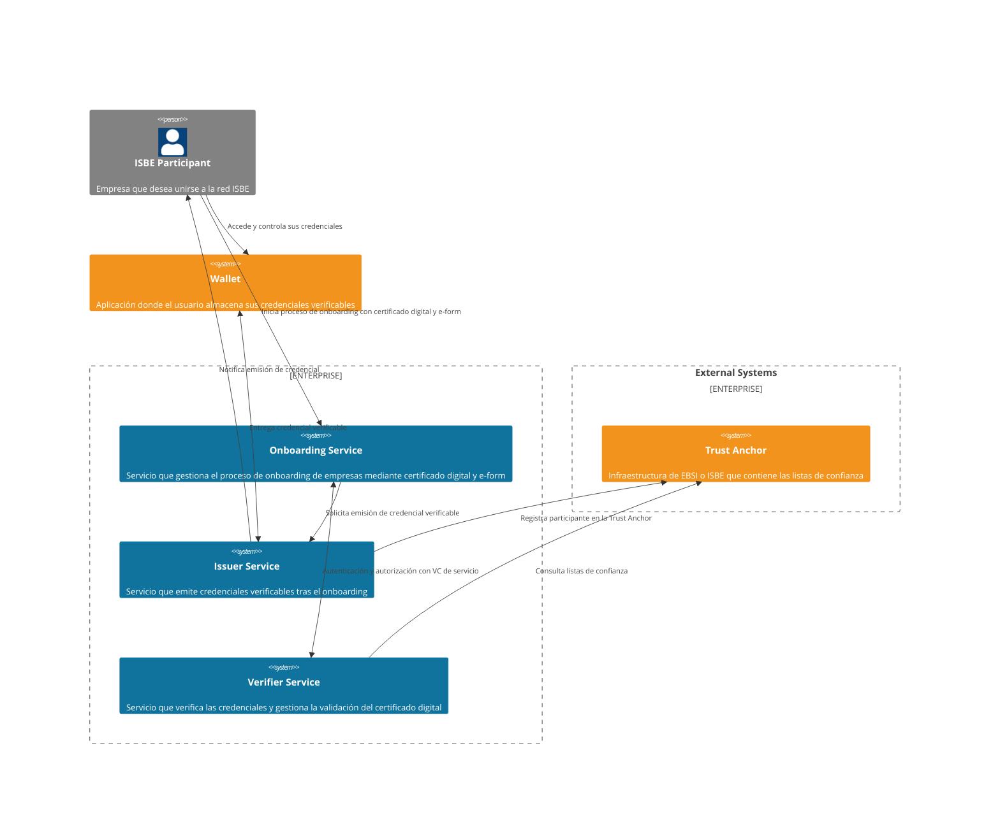

# ISBE-ARTIFACT-04010 - Onboarding de empresas a ISBE

## **1. Identificación del Artefacto**

| Campo                     | Valor                                                                                                                                                                                           |
|---------------------------|-------------------------------------------------------------------------------------------------------------------------------------------------------------------------------------------------|
| **Nombre del artefacto**  | ISBE-ART-04010 — Onboarding de empresas a ISBE                                                                                                                                                  |
| **Origen**                | Solución que permite a las empresas poseedoras de un certificado digital realizar el onboarding en ISBE de manera self-service y obtener una credencial verificable como resultado del proceso. |
| **Estado**                | *En desarrollo*                                                                                                                                                                                 |
| **Versión del documento** | *0.1.0*                                                                                                                                                                                         |
| **Fecha**                 | *2025-09-09*                                                                                                                                                                                    |
| **Repositorio**           | [https://github.com/alastria/isbe-gobernanza-onboarding](https://github.com/alastria/isbe-gobernanza-onboarding)                                                                                |
| **Commit**                | N/A                                                                                                                                                                                             |

## **2. Propósito del Artefacto**

- **Objetivo funcional:** Facilitar el registro y acceso de empresas en ISBE mediante un flujo de alta completamente digital, utilizando certificados digitales cualificados. El sistema valida el certificado presentado, permite completar un formulario de datos básicos y emite una credencial verificable.

- **Beneficio para ISBE:** Asegura un onboarding ágil, estandarizado y conforme a normativa para empresas, reduciendo costes de verificación manual y garantizando interoperabilidad con el ecosistema europeo (EBSI).

- **Stakeholders clave:**  
  - **Equipos técnicos ISBE**: desarrollo, despliegue e integración de la solución, 
  - **Empresas usuarias**: identificación simplificada y acceso a ISBE. 
  - **Reguladores y auditores**: cumplimiento de normativa eIDAS2 y GDPR. 
  - **Otros proveedores**: integraciones con Trust Anchor y Wallet externos.

## **3. Alcance y Ciclo de Vida**

- **Fases cubiertas:**

  - 🟡 **Planificación:** acotar alcance, dependencias externas y plan de entregas. [Plan de proyecto](../proyecto/PLAN_DE_PROYECTO.md) 
  
  - 🟡 **Análisis:** convertir el alcance en requisitos verificables y contratos funcionales. [Documento Técnico](../proyecto/DOCUMENTO_TECNICO.md)
  
  - 🟡 **Diseño:** diseñar componentes, interfaces y seguridad end-to-end. [Documento de Diseño](../proyecto/DOCUMENTO_DISE%C3%91O.md) 
  
  - 🟡 **Implementación:** construir y configurar los componentes comprometidos.
  
  - 🟡 **Pruebas:** asegurar conformidad funcional, interoperabilidad y NFR. [Plan de pruebas](../proyecto/PLAN_DE_PRUEBAS.md)
  
  - 🟡 **Despliegue:** poner el servicio en PRD de forma segura y replicable. [Plan de despliegue](../proyecto/PLAN_DE_DESPLIEGUE.md)
  
  - 🟡 **Mantenimiento:** asegurar continuidad operativa, cumplimiento y evolución. [Plan de mantenimiento](../proyecto/PLAN_DE_MANTENIMIENTO.md)
  
  > NOTA: El artefacto cubre el ciclo completo siguiendo la metodología de desarrollo ágil (Software Development Life Cycle - SDLC) y DevOps, garantizando entregas iterativas y mejora continua.

- **Dependencias**:

  - **Trust Anchor**: sistema externo que mantiene las listas de confianza (EBSI/ISBE).
  > NOTA: La disponibilidad y conformidad del Trust Anchor es crítica para la validación de certificados y registro de participantes. Aún no se ha definido el proveedor concreto.
  
  - **Wallet**: sistema externo donde el usuario final almacena y gestiona sus credenciales verificables.
  > NOTA: La solución no incluye la provisión ni gestión de Wallets, pero depende de su disponibilidad y conformidad con estándares OID4VCI/OID4VP.

  - **Servicio de firma remoto**: sistema externo para la firma digital y su validación.
  > NOTA: Dentro del proyecto ISBE este servicio es provisto por un tercero (DIGITEL TS) y es crítico para la firma de credenciales verificables.
  
- **Mantenimiento:**

  - Actualización periódica de librerías de validación de certificados dentro del contrato de mantenimiento de servicio que se establezca al finalizar el proyecto y su periodo de garantía.
  
  - Evolución del Issuer/Verifier en función de nuevas releases de protocolos OIDC4VCI / OID4VP. Estos componentes son open source y es responsabilidad del equipo de operaciones del proyecto el mantenerlos actualizados más allá del periodo de garantía.
  
  - Cualquier ampliación o cambio en los flujos de onboarding deberá ser evaluado y planificado como parte del contrato de mantenimiento.
  
  > NOTA: El mantenimiento del artefacto se realizará conforme al Plan de mantenimiento y puede consultarse [aquí](../proyecto/PLAN_DE_MANTENIMIENTO.md).

## **4. Definición del Artefacto**

- **4.1. Artefacto de arquitectura de referencia:**

El artefacto **ISBE-ARTIFACT-04010** se fundamenta en una arquitectura de referencia de identidad digital distribuida, en la que el proceso de onboarding de empresas se articula en torno a tres componentes principales provistos por nuestro equipo: **Onboarding Service**, **Issuer Service** y **Verifier Service**.

El diagrama de nivel 2 (C4) representa la interacción entre dichos componentes, los participantes externos y las infraestructuras de confianza:

- **ISBE Participant (Empresa)**: el actor que inicia el proceso presentando su certificado digital cualificado y completando el e-form de registro. 
- **Onboarding Service**: gestiona el flujo de alta, valida la información proporcionada y orquesta las interacciones con el Issuer y el Verifier.
- **Issuer Service**: emite la credencial verificable (**LEARCredentialEmployee**) del LEAR de la empresa registrada en ISBE tras la validación exitosa del certificado y los datos. También registra al nuevo participante en la red de confianza (Trust Anchor). 
- **Verifier Service**: valida certificados digitales y credenciales verificables, asegurando que las empresas y servicios que acceden o participan del ecosistema lo hacen con atributos auténticos y vigentes.
- **Wallet *(externo)***: aplicación en la que el usuario recibe, almacena y gestiona la credencial emitida. Este componente no es provisto por nuestro equipo, pero es esencial para la custodia y el uso posterior de la credencial.
- **Trust Anchor (EBSI/ISBE/LOTL)**: infraestructura externa que mantiene las listas de confianza y entidades válidas. El Issuer y el Verifier dependen de este servicio para realizar la validación y el registro de nuevos participantes.

La arquitectura refleja el paradigma descentralizado de identidad digital:
- El Trust Anchor actúa como fuente de confianza común. 
- El Issuer otorga credenciales verificables tras el onboarding. 
- El Verifier garantiza la validez de los atributos presentados en procesos M2M. 
- El Wallet asegura la soberanía del participante sobre sus credenciales. 

> NOTA: Esta arquitectura permite cumplir con los principios de interoperabilidad (**OID4VCI** y **OID4VP**), alineamiento con **eIDAS2** y resiliencia en un contexto federado, donde cada componente puede evolucionar o ser operado por diferentes entidades sin comprometer el flujo global.

Diagrama C4-Level 2:


- **4.2. Trazabilidad:**

**Onboarding Service**:

- REQ-001: Proveer e-form multilingüe (ES/EN) para alta de empresas con validación de campos en cliente/servidor. 
- REQ-002: Mostrar consentimiento y términos (GDPR) y registrar la aceptación con sello de tiempo. 
- REQ-003: Accesibilidad WCAG 2.1 AA y diseño responsive. 
- REQ-004: Generar desafío de firma y capturar prueba criptográfica del certificado cualificado del representante. 
- REQ-005: Invocar la Verifier para validación de certificado (firma, cadena) y recibir veredicto (válido/no válido + motivos). 
- REQ-006: Permitir reintento controlado ante fallos recuperables (p.ej., OCSP temporalmente no disponible). 
- REQ-007: Solicitar al Issuer una credential con los datos recopilados del e-form tras validación exitosa.
- REQ-008: Solicitar el token de acceso al Verifier con la LEARCredentialMachine de servicio para autenticar la petición al Issuer.

**Issuer Service**:

- REQ-030: Validar el token de acceso del Onboarding Service y la LEARCredentialMachine de servicio.
- REQ-031: Generar y firmar la LEARCredentialEmployee conforme a OID4VCI con los datos del e-form y el certificado cualificado.
- REQ-032: Incluir metadatos de emisor, esquema, políticas y términos de uso en la credencial.
- REQ-033: Registrar al nuevo participante en la Trust Anchor (ISBE/EBSI).
- REQ-034: Notificar al Onboarding Service el resultado de la emisión (éxito/fallo + motivos).
- REQ-035: Soportar reintentos controlados ante fallos temporales (p.ej., Trust Anchor no disponible).

**Verifier Service**:

- REQ-060: Validar tokens de acceso y credenciales verificables conforme a OID4VP.
- REQ-061: Validar certificados digitales cualificados (firma, cadena, revocación) usando listas de confianza del Trust Anchor.
- REQ-062: Integración con el Trust Anchor para obtener listas de confianza actualizadas.
- REQ-063: Integrar con el servicio de PDP para aplicar reglas de negocio de elegibilidad.

**Transversal**:

- REQ-090: Minimización de datos: almacenar solo lo necesario para trazabilidad legal y auditoría.

Con la arquitectura de referencia:
    - Onboarding Service → responde a los requisitos de acceso self-service de empresas y actúa como orquestador del flujo de registro. 
    - Verifier Service → cubre los requisitos de validación de certificados digitales cualificados y de verificación de credenciales verificables en procesos de autorización posteriores. 
    - Issuer Service → se vincula con los requisitos de emisión de credenciales verificables de empresa registrada, asegurando su conformidad con estándares OID4VCI. 
    - Trust Anchor (externo) → garantiza el cumplimiento de los requisitos de uso de listas de confianza EBSI/ISBE en validaciones. 
    - Wallet (externo) → materializa el principio de soberanía del participante sobre su identidad digital, permitiendo almacenar y presentar las credenciales emitidas. 
    - Service Catalog → demuestra la aplicabilidad de las credenciales emitidas y validadas en un caso de uso real de consumo de servicios ISBE.
  
    Con requisitos funcionales (ejemplos):
    - **ISBE-REQ-0100**: Validación de certificado digital cualificado → Verifier Service + Trust Anchor. 
    - **ISBE-REQ-0110**: Registro de empresa mediante formulario electrónico → Onboarding Service. 
    - **ISBE-REQ-0120**: Emisión de credencial verificable de empresa → Issuer Service. 
    - **ISBE-REQ-0130**: Custodia y presentación de credenciales → Wallet (no provisto por este artefacto). 
    - **ISBE-REQ-0140**: Acceso a servicios del catálogo mediante credenciales verificables → Verifier Service + Service Catalog.
  
    Con requisitos no funcionales (ejemplos):
    - **Seguridad**: validación criptográfica de certificados y credenciales, conforme a eIDAS2 y OID4VC. 
    - **Interoperabilidad**: alineamiento con OIDC4VCI (emisión) y OID4VP (presentación). 
    - **Privacidad**: cumplimiento de GDPR mediante minimización de datos y control por parte del participante. 
    - **Disponibilidad y rendimiento**: capacidad de validar certificados en <2s y garantizar 99,5% de uptime en servicios críticos.


- **4.3. Descripción funcional detallada:**

    El artefacto implementa un conjunto de flujos de datos y casos de uso que permiten a una empresa integrarse en la red ISBE, obtener una credencial verificable de registro y utilizarla para acceder a los servicios del ecosistema.

    **Flujos de datos principales**

    1. **Inicio de Onboarding**
       - El participante empresarial accede al Onboarding Service. 
       - Se presenta un certificado digital cualificado (eIDAS QTSP). 
       - El sistema recolecta datos básicos a través de un e-form.
    2. **Validación de identidad**
       - El Verifier Service valida la firma del certificado digital y comprueba su vigencia contra las listas de confianza del Trust Anchor (ISBE/EBSI). 
       - Se aplican reglas de negocio de elegibilidad (certificado activo, no revocado, emitido por QTSP reconocido).
    3. **Emisión de credencial verificable**
       - Una vez validada la identidad, el Issuer Service genera una credencial verificable de empresa registrada en ISBE. 
       - La credencial se entrega al Wallet de la empresa para su custodia.
    4. **Registro en la red de confianza**
       - El Issuer Service comunica al Trust Anchor el alta de la nueva empresa como participante válido de ISBE.
    5. **Uso de credenciales**
       - La empresa utiliza su Wallet para presentar la credencial verificable en procesos de acceso al Service Catalog.
       - El Service Catalog delega en el Verifier Service la validación de la credencial, confirmando la autenticidad y vigencia de la empresa participante.
  
    **Casos de uso cubiertos**

    - **CU-01**. Onboarding self-service de empresa: Alta autónoma en ISBE mediante certificado digital. 
    - **CU-02**. Validación de certificado cualificado: Comprobación criptográfica + listas de confianza. 
    - **CU-03**. Emisión de credencial verificable de empresa: Generación conforme a OIDC4VCI. 
    - **CU-04**. Custodia de credenciales: Delegado a Wallet externo gestionado por la empresa. 
    - **CU-05**. Presentación de credenciales: Uso de OID4VP en el acceso al catálogo de servicios. 
    - **CU-06**. Registro en red de confianza: Alta del participante en Trust Anchor ISBE/EBSI.
    
    **Escenarios cubiertos**

    - **Escenario A**: Onboarding exitoso 
      - El certificado es válido y se emite la credencial. 
      - La empresa queda registrada en la red ISBE.
    - **Escenario B**: Certificado inválido o revocado 
      - El Verifier rechaza la validación. 
      - No se emite credencial, se notifica al usuario.
    - **Escenario C**: Acceso a servicios ISBE
      - La empresa presenta la credencial en el catálogo de servicios. 
      - El Verifier confirma validez y el catálogo otorga acceso.
    - **Escenario D**: Renovación / actualización de credencial
      - En caso de cambio o caducidad del certificado digital, el flujo de onboarding se reinicia para emitir una nueva credencial.

- **4.4. Modelos o diagramas específicos:**

    Diagrama de componentes, interfaces, secuencias, flujos.

  ```mermaid
      sequenceDiagram
  
        participant P as Customer
        participant W as Wallet (tercero)
        
        participant A as Onboarding Service
        participant I as Issuer Service
        
        participant T as Trust Anchor (ISBE/EBSI)
        
        P ->>A: e-form + Cert. cualificado
        A -->>V: |Validación cert.| V
        V -->T: |Listas de confianza / OCSP/CRL| T
        A -->I: |Solicitud emisión| I
        I -->T: |Registro participante| T
        I -->W: |Credential Offer / VC| W
        W -->W: |Almacena VC| W
        S -->V: |AuthZ & VP request| V
        W -->V: |vp_token + presentation_submission| V
        V -->T: |Validación emisor/estado| T
        V -->S: |Tokens/Resultado verificación| S
  ```

- **4.5. Reglas de negocio asociadas:**

    Validaciones, restricciones operativas.

- **4.6. Interfaces y puntos de integración:**

    APIs, endpoints, eventos, contratos de datos.

    Interfaces públicas

- **4.7. Normativas y requisitos regulatorios:**

    RGPD, estándares específicos si aplican.

- **4.8. Criterios de calidad específicos:**

    Rendimiento esperado, seguridad, usabilidad.

## **5. Desarrollo del Artefacto**

- **5.1. Componentes del artefacto:**

    Lista de elementos clave producidos: código, scripts, configuraciones, manuales.

- **5.2. Lista de elementos clave producidos: código, scripts, configuraciones, manuales:**

    Ejemplo: Código, contenedor, JSON, Word, Excel.
    | Nombre | Descripción | Enlace |
    |--------|-------------|--------|
    | Código | Repositorio GitHub | ... |
    | Manual | ... | ... |
    | Última versión liberada | Versiones liberadas y etiquetado de release | ... |

- **5.3. Frameworks, librerías o tecnologías acordadas:**

    Bases técnicas y stack definido.

- **5.4. Buenas prácticas aplicables:**

    Seguridad, rendimiento, mantenibilidad.

- **5.5. Criterios de validación del desarrollo:**

    Pruebas unitarias realizadas, auditorías, evidencias de funcionamiento.

- **5.6. Alineación con requisitos legales (GDPR, NIS2, etc.)**
    si aplica.
- **5.7. Dependencias técnicas o de infraestructura:**

    Sistemas, entornos, herramientas necesarias.

- **5.8. Limitaciones temporales:**

    MVP, iteraciones parciales, restricciones conocidas.

- **5.9. Limitaciones por versiones, licencias o configuraciones.**

## **6. Reglas de Control y Actualización**

- Política de gestión de versiones para la fase de definición y desarrollo.
- Indicar si es actualizable tras la entrega, por quién y bajo qué condiciones.
- Frecuencia de revisión o actualizaciones planificadas.
- Herramienta de control de cambios: repositorio, SharePoint, wiki técnica, etc.

| Tipo de cambio  | Versionado | Flujo de aprobación        | Documentación requerida  |
|-----------------|------------|----------------------------|--------------------------|
| Evolutivo menor | X.Y+0.1    | Pull Request + revisión GT | Release notes detalladas |
| Evolutivo mayor | X+1.0      | Al Comité de ¿?            | Impacto                  |
