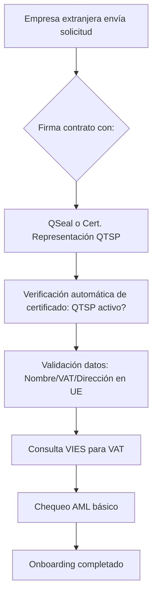

Para que ISBE cumpla con la regulación aplicable y verifique con alto nivel de certeza legal que una organización (española o de otro país de la UE/EEE) tiene sede o establecimiento en la UE/EEE, debe seguir un proceso de onboarding/KYC mínimo pero robusto, basado en los siguientes requisitos regulatorios:

### Regulación Aplicable Clave
1. **Directivas contra el Blanqueo de Capitales (AML/CFT):**  
   - 5ª Directiva (UE) 2018/843 y 6ª Directiva (UE) 2021/1237, transpuestas en España por la Ley 10/2010.  
   - Requieren la verificación de la identidad de clientes empresariales ("Know Your Business Customer" o KYBC), incluyendo sede y beneficiarios reales.
2. **Reglamento de Servicios Digitales (DSA - Digital Services Act, Reglamento (UE) 2022/2065):**  
   - Artículo 24: Obliga a las plataformas en línea a verificar la información de los "traders" (empresas que venden servicios/bienes).  
   - Exige recopilar, verificar y mantener datos actualizados de la empresa (nombre, dirección, registro legal, identificación fiscal).
3. **Reglamentos de Mercado Interior (e.g., Directiva de Servicios 2006/123/CE):**  
   - Requieren no discriminar empresas de otros Estados miembro y basarse en registros oficiales para verificar su legitimidad.
4. **GDPR (Reglamento (UE) 2016/679):**  
   - Aplica al tratamiento de datos personales durante el onboarding (ej. datos de representantes legales).

---

### Proceso Mínimo de Onboarding/KYC
El proceso debe ser **proporcional** (sencillo para empresas de la UE/EEE) y basarse en **fuentes autorizadas**. Pasos esenciales:

#### **1. Recopilación de Información Básica (Due Diligence Simplificada)**  
   - **Datos obligatorios a solicitar:**  
     - Nombre legal completo de la empresa.  
     - Dirección física de la sede principal (debe estar en la UE/EEE).  
     - Número de identificación fiscal (VAT number) en su país de origen.  
     - Número de registro oficial (e.g., del registro mercantil nacional).  
     - País de establecimiento (si aplica, para casos de sucursales).  
   - **Documentos a requerir:**  
     - Certificado de registro mercantil actualizado (≤ 3 meses) emitido por autoridad competente.  
     - Prueba de identificación fiscal (e.g., certificado de VAT).

#### **2. Verificación con Fuentes Autorizadas**  
   - **Verificación del registro mercantil:**  
     - Consultar el **registro mercantil del país de origen** de la empresa mediante:  
       - **Portal Europeo de Justicia Electrónica (e-Justice)**: Acceso centralizado a registros mercantiles nacionales.  
       - **Bases de datos oficiales nacionales**: Ej. Companies House (Reino Unido), Unternehmensregister (Alemania), Registre du commerce et des sociétés (Francia), etc.  
     - **Criterio mínimo**: Confirmar que la empresa figura como "activa" y su dirección está en la UE/EEE.  
   - **Verificación del VAT number:**  
     - Usar el **sistema VIES** (VAT Information Exchange System) de la UE:  
       - Valida en tiempo real el número de IVA y confirma el país de registro.  
       - [Acceso aquí](https://ec.europa.eu/taxation_customs/vies/).  
   - **Verificación de establecimiento permanente (si aplica):**  
     - Si la empresa no tiene sede en UE/EEE pero sí un establecimiento:  
       - Solicitar prueba de registro en el país donde opera (e.g., certificado de sucursal del registro mercantil local).  
       - Alternativa: Contrato de arrendamiento de oficina o factura de servicios públicos con su dirección en UE/EEE (menos preferible, solo si no hay registro oficial).

#### **3. Due Diligencia de Beneficiarios Reales (UBOs)**  
   - **Requisito AML**: Identificar a los beneficiarios reales (personas físicas que posean >25% de la empresa o ejerzan control).  
     - Solicitar declaración de UBOs firmada por la empresa.  
     - Verificar identidades con documentos oficiales (DNI/pasaporte) y cruzar con registros como el **Registro Central de Beneficiarios Reales** del país de origen.  
   - *Excepción*: Si la empresa cotiza en bolsa UE/EEE, no es necesario.

#### **4. Controles Adicionales de Riesgo**  
   - **Evaluación simplificada de riesgo**:  
     - Confirmar que la empresa no figura en listas sancionadas (e.g., UE Sanctions List, ONU) mediante herramientas como **WorldCheck o similares**.  
     - Chequear alertas públicas (e.g., insolvencia) en registros mercantiles.  
   - **No se requiere**: Análisis financiero profundo (solo aplicable a relaciones de alto riesgo AML).

#### **5. Documentación y Conservación de Registros**  
   - **Almacenar**: Copias de documentos y comprobantes de verificación (ej. captura de VIES, extracto de registro).  
   - **Plazo mínimo**: 5 años tras finalizar la relación (por AML y DSA).  
   - **Cumplir GDPR**: Informar sobre el uso de datos y obtener consentimiento para tratar datos personales (ej. de UBOs).

---

### Nivel de Certeza Legal y Mejores Prácticas
- **Certeza alta**: Basarse **exclusivamente en fuentes oficiales** (registros públicos, VIES) minimiza el riesgo legal.  
- **Ventaja UE**: Al ser empresa de otro Estado miembro, la armonización regulatoria permite verificación rápida y fiable.  
- **Red flags a monitorear**:  
  - Discrepancias entre la dirección declarada y la del registro.  
  - VAT number inválido en VIES.  
  - Registro mercantil "inactivo" o "en liquidación".  
- **Automatización recomendada**: Usar APIs de registros mercantiles o servicios KYBC (e.g., OpenCorporates, Dun & Bradstreet) para agilizar.

### Consecuencias de Incumplimiento
- **Sanciones por DSA**: Hasta 6% de ingresos globales por no verificar "traders".  
- **Sanciones AML**: Multas por incumplir due diligence (en España, hasta €5M o 5% de ingresos).  
- **Riesgos reputacionales**: Permitir operar a empresas no elegibles podría invalidar los términos del marketplace.

Este proceso cumple con el mínimo regulatorio y es proporcional para empresas de la UE/EEE. Si la empresa fuera de fuera de la UE/EEE, se requeriría due diligence reforzada.

---

La utilización de **certificados electrónicos cualificados** (emitidos por un Prestador de Servicios de Confianza Cualificado, *QTSP*) para la firma del contrato simplifica significativamente el proceso de onboarding, ya que estos instrumentos tienen **valor probatorio reforzado** bajo el Reglamento eIDAS (UE 910/2014) y presunción de autenticidad e integridad. Aquí el desglose:

---

### **1. Simplificación mediante Certificado Cualificado de Sello Electrónico (*QSeal*)**  
**Qué es**: Un *QSeal* es un certificado que autentica a una **persona jurídica** (no a una persona física). Garantiza que un documento digital (ej. contrato) ha sido emitido por la empresa.  

**Proceso simplificado**:  
- **Reemplaza la verificación manual de identidad**:  
  - Al firmar el contrato con *QSeal*, la empresa extranjera **automatiza la prueba de su existencia legal y sede en la UE/EEE**, ya que el QTSP ya realizó una verificación rigurosa al emitir el certificado.  
  - El *QSeal* incluye metadatos verificados: **nombre legal, dirección de sede y número de identificación fiscal** (VAT).  

- **Acciones que se eliminan**:  
  ❌ No es necesario solicitar copias físicas del certificado mercantil.  
  ❌ No se requiere verificación manual en registros mercantiles nacionales (ej. vía e-Justice).  

- **Pasos mínimos restantes**:  
  1. Validar que el *QSeal* está **activo y emitido por un QTSP de la UE** (lista oficial [aquí](https://webgate.ec.europa.eu/tl-browser/)).  
  2. Confirmar que los datos del certificado (**nombre, dirección, VAT**) coinciden con los proporcionados en el contrato.  
  3. Verificar el **VAT number** en el sistema **VIES** (para asegurar vigencia y ubicación UE/EEE).  
  4. Realizar un **chequeo AML básico** (listas sancionadas, beneficiarios reales si aplica).  

---

### **2. Simplificación mediante Certificado Cualificado de Representación (*QCert for Legal Persons*)**  
**Qué es**: Un certificado que acredita no solo la identidad de la empresa, sino también **la capacidad de representación legal de quien firma** (ej. CEO, apoderado). Es el estándar más robusto.  

**Proceso simplificado**:  
- **Reemplaza la verificación de poderes y representación legal**:  
  - El QTSP verifica **dos aspectos críticos**:  
    a) La existencia legal y datos de la empresa.  
    b) La identidad y poderes del firmante (mediante poderes notariales o registro mercantil).  
  - El certificado incluye: **datos de la empresa + nombre/cargo del representante + alcance de sus poderes**.  

- **Acciones que se eliminan**:  
  ❌ No se requiere solicitar copias de poderes notariales o actas de nombramiento.  
  ❌ No es necesario verificar manualmente la capacidad del firmante en registros.  

- **Pasos mínimos restantes**:  
  1. Validar que el certificado de representación es **emitido por un QTSP de la UE** y está activo.  
  2. Confirmar que los **datos de la empresa** (nombre, dirección, VAT) en el certificado coinciden con el contrato.  
  3. Verificar el **VAT en VIES**.  
  4. Chequeo AML de **beneficiarios reales** (si la empresa no está cotizada).  

---

### **Ventajas clave de este enfoque**  
| **Aspecto**                | **Beneficio**                                                                 |
|----------------------------|-------------------------------------------------------------------------------|
| **Certeza legal**          | Presunción de autenticidad e integridad (Art. 35 eIDAS). Admisible en tribunales de toda la UE. |
| **Cumplimiento AML/DSA**   | Satisface requisitos de "verificación fiable" del DSA (Art. 24) y AML (Due Diligencia). |
| **Eficiencia**             | Reduce el onboarding de días/horas a minutos. Elimina gestión documental física. |
| **Riesgo operativo**       | Minimiza errores humanos en verificación de identidad o poderes.              |

---

### **Requisitos críticos para garantizar validez**  
1. **El certificado debe ser emitido por un QTSP de la UE/EEE** (verificado en el [TL Browser](https://webgate.ec.europa.eu/tl-browser/)).  
2. **La dirección de la empresa en el certificado debe estar en la UE/EEE**.  
3. **El contrato debe firmarse con el mismo certificado** (no vale adjuntarlo como "prueba" sin usarlo para firmar).  

---

### **Flujo de onboarding simplificado**  

---

### **Conclusión**  
El uso de **QSeal o certificados de representación cualificados** permite:  
- **Eliminar el 80% de la carga manual** (verificación de registros, poderes, documentos físicos).  
- **Mantener un nivel de certeza legal máximo** (presunción reglamentaria bajo eIDAS).  
- **Cumplir con DSA, AML y GDPR** de manera eficiente.  

> **Nota crítica**: Este modelo requiere que la empresa extranjera ya posea dichos certificados. Si no los tiene, su obtención puede demorar semanas. En esos casos, el proceso estándar (con verificación en registros) sigue siendo necesario.