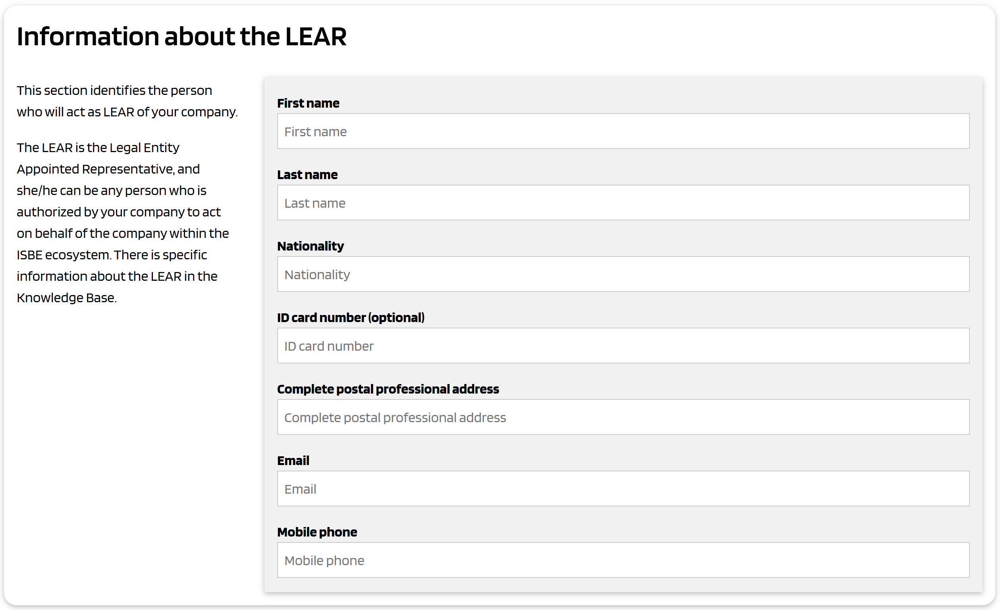

# Onboarding process

The onboarding process of an organization in ISBE consists of two phases.

The first phase is composed of the following steps:

1. Gather information about the organization and the employee acting on behalf of the organization in ISBE
2. Generate automatically contractual documents including that information
3. A legal representative of the organization signs the contractual documents
4. The documents are received and verified by ISBE
5. The organization is registered as onboarded in ISBE, and it has an account.

After the company is onboarded, ISBE generates a Verifiable Credential to the employee appointed during the first phase. This Verifiable Credential is an electronic mandate which will be used by the employee to authenticate to ISBE to operate the account of the organization.

This second phase is performed automatically after the first phase and consists of the following steps:

6. A Verifiable Credential is issued to the employee identified during the first phase
7. The employee accepts the credential and stores it in an EUDI-compatible wallet
8. The employee uses the credential to authenticate to the ISBE portal to complete the onboarding process, for example:
   - Complete information about the organization, like logo, commercial messages, etc.
   - Issue additional Verifiable Credentials to additional employees with specific powers to enable them perform some operatuions in the ISBE ecosystem.
   - Add product offerings and publish them in the ISBE Marketplace, to gain visibility and facilitate selling the services.

The following sections provide more details.

- [Onboarding process](#onboarding-process)
- [Gather information](#gather-information)
  - [Verify email of person driving the process](#verify-email-of-person-driving-the-process)
  - [Accept terms and conditions](#accept-terms-and-conditions)
  - [Company information](#company-information)
  - [Information about the LEAR](#information-about-the-lear)
    - [Why we need a LEAR appointment form?](#why-we-need-a-lear-appointment-form)
    - [Who can be designated as a LEAR](#who-can-be-designated-as-a-lear)
- [Generate contractual documents](#generate-contractual-documents)
- [Signature of the contractual documents](#signature-of-the-contractual-documents)
- [Receiving and verifying the contractual documents](#receiving-and-verifying-the-contractual-documents)
- [Registration of the organization and initial account creation](#registration-of-the-organization-and-initial-account-creation)
- [Identity of an employee acting on behalf of the organization](#identity-of-an-employee-acting-on-behalf-of-the-organization)
  - [Attaching specific authorizations to the identity of the employee](#attaching-specific-authorizations-to-the-identity-of-the-employee)
  - [The Verifiable Credential as a Mandate](#the-verifiable-credential-as-a-mandate)
    - [Mandator](#mandator)
    - [Mandatee](#mandatee)
    - [Signer](#signer)
    - [Powers](#powers)
  - [On the signature of the mandate](#on-the-signature-of-the-mandate)
- [Identifiers of Organizations](#identifiers-of-organizations)
    - [Relationship between the NIF and advanced and qualified signatures of documents](#relationship-between-the-nif-and-advanced-and-qualified-signatures-of-documents)
  - [Verification of the real-world identity of the Organization](#verification-of-the-real-world-identity-of-the-organization)
    - [Relationship with onboarding of relying parties in the EUDIW ecosystem](#relationship-with-onboarding-of-relying-parties-in-the-eudiw-ecosystem)
  - [Verification of the identity of the legal representative](#verification-of-the-identity-of-the-legal-representative)
- [The NIF and Verifiable Credentials issued by organizations](#the-nif-and-verifiable-credentials-issued-by-organizations)
  - [The Verifiable Credential as a legally binding document](#the-verifiable-credential-as-a-legally-binding-document)
  - [The `did:elsi` method](#the-didelsi-method)
  - [Comparison with other DID methods](#comparison-with-other-did-methods)

# Gather information

## Verify email of person driving the process

We allow that the person driving the process of onboarding be a normal employee, instead of a legal representative of the organization. Later in the process, the employee will have to submit one or more documents signed by a legal representative of the organization, to achieve the proper legal certainty in the onboarding process.

In any case, the person driving the process has to verify his/her email address. This is achieved in the following way:

1. A simple form is displayed in the ISBE onboarding page.
2. The person enters his/her name and email.
3. The ISBE onboarding system sends an email to the specified address with a verification mechanism (a one-time verification code).
4. The person uses the code to verify his/her email address.
5. The ISBE onboarding system stores the registration with that email address, and allows the person to continue with the process

## Accept terms and conditions

The person driving the process will have to accept the terms and conditions of ISBE. The above form is just an example. The acceptance will be registered in the onboarding database.

## Company information

The person driving the process will enter information about the company. The above form is just an example.

**Limitation on the country**: We only allow organizations which either have the headquarters incorporated in an EU/EEA country, or a legal representative in an EU/EEA country.

The user must select the country from a list with the allowed countries. We will check that the country is correct when later in the process we check the electronic signature of the contract that the company will send to ISBE.

## Information about the LEAR

This section identifies the person who will act as **LEAR** of the company.

The LEAR is the Legal Entity Appointed Representative, and she/he can be any person who is authorized by a legal representative of the company to act on behalf of the company within the ISBE ecosystem.

This is needed because normally the legal representative of the organization is not able to perform the day-to-day operations needed in ISBE. We allow the company (the legal representative of the company) to nominate/appoint a person to act on behalf of the company in ISBE.

### Why we need a LEAR appointment form?

The aim of the Legal Entity Appointed Representative (LEAR) Form is twofold: first, to provide legal certainty for ISBE that the actions taken by the people operating the account of a company are legally binding to the company, either vis-à-vis ISBE and the partners of the ISBE ecosystem; and second, as a consequence of the first, to generate a plus of trust in the ISBE ecosystem partners regarding the identity of the company.

Further, the LEAR having full power to bind the entity she/he represents is coherent with the verifiable credentials scheme that ISBE uses to allow a swift, fully digital and trustworthy system to structure communications and transactions within the ecosystem. 

The verifiable credentials system implemented in ISBE is based on the claim that the people operating the account of an organization have the authority to represent that organization and to legally bind it.

ISBE, that is the issuer of the verifiable credentials, needs to verify that the operators of the organization account in ISBE do have the powers needed to fully operate the account. This verification is made through the LEAR appointment form and the rest of the documentation requested in the onboarding phase.

### Who can be designated as a LEAR

Any person of legal age can be designated as the LEAR of an entity. There is not any further limitation on this aspect.

That means that an entity can appoint as its LEAR either an employee (regardless of its position in the company) or even someone who is not linked to the entity at all.

However, the entity appointing a LEAR should carefully consider who is the right person to fill the role.

This person should be someone who is trusted by the entity’s management and with the right qualifications and skills to hold this position, for his/her actions may yield legal liabilities on the entity.
 
Also, the same individual can be appointed as the LEAR by more than one entity. Each appointment will generate its own and separate verifiable credential, so the individual can only represent one single entity at a time when operating in the Marketplace.

# Generate contractual documents

The onboarding system generates automatically contractual documents, using the information provided in the forms described above.
The documents are in PDF format, which have to be signed by a legal representative of the organization and then uploaded in the ISBE portal to continue with the onboarding process.

# Signature of the contractual documents

The proposal is to require the legal representative to electronically sign the documents using an eIDAS certificate of representation issued by a QTSP (Qualified Trust Service Provider) to the legal representative.

eIDAS certificates, particularly qualified ones, have a wide adoption is Spain and are the cornerstone of trust, legal validity,
and interoperability in Spain's structured data exchange systems. They provide the necessary assurances of
identity, integrity, and non-repudiation that are essential for the digital transformation of administrative
and commercial processes.

When using an eIDAS certificate of representation , the verification of the identity of the organization and the legal representative comes for free and with a LoA (Level of Assurance) which is substantial or high depending on whether an advanced or qualified electronic signature was used.

The recommendation is to avoid hand-written signatures which imply costly and cumbersome manual processes. If this can not be avoided, it should be handled as an exceptional procedure which sould be reduced to the minimum possible.

# Receiving and verifying the contractual documents

The ISBE onboarding portal allows organizations to upload the signed contractual documents, associated to the instance of the onboarding process started in the previous steps.

The ISBE onboarding process performs some automatic verifications (like signature verification), and notifies some ISBE employee that an onboarding process is pending for manual review and approval.

# Registration of the organization and initial account creation

After approval by an employee of ISBE, the new organization is registered in ISBE and an account is created with initial data.
Immediately after this and automatically, the ISBE onboarding system generates a Verifiable Credential to the employee appointed during the first phase.

This Verifiable Credential fulfils two purposes at the same time:

-  As an **authentication** mechanism for the employee, serving as the digital identity of that employee in ISBE
   and with other participants.

-  As a **mandate**, proving that the employee has been authorized by the organization (strictly speaking, by a
   legal representative of the organization) to perform specific activities on behalf of the organization.

# Identity of an employee acting on behalf of the organization

In most cases, an organization does not act by itself, but instead it is an employee of the organization the
one interacting with third parties, where the employee is acting on behalf of the organization. For example,
when an organization onboards in ISBE, or performs any other administrative task, it is an employee the one
who performs the processes.

> [!Note]
>
> In some other cases, there may be one or more machines, controlled by the organization, performing some
> automated work (e.g., calling APIs of third-parties). We will talk about identities of machines/workloads
> later in this document.

If the person performing the activities is the legal representative, we already have a secure and efficient
mechanism to authenticate that person: using the certificate of representation described in the section above.

However, **in many organizations the legal representative can not be involved in the daily operations with
ISBE (or with other parties)**. We need a mechanism to enable the legal representative of the organization to
"nominate" or "appoint" an employee and delegate to that employee a defined set of powers enough for
performing the activities in ISBE.

In the context of ISBE, we can achieve this with a document signed by the legal representative with the same
certificate of representation used to sign the other contractual documents. The document has to explicitly
appoint an employee to act on behalf of the organization, and if we trust on the legal representative, then we
do not have to perform any verification on that employee.

The appointment document has to be submitted as part of the onboarding process, together with the other
documents.

After the onboarding process, ISBE will issue a Verifiable Credential to the appointed employee, which will be
used by the employee to authenticate against the ISBE portal and any other entity willing to accept the
credential as an authentication mechanism (because they trust on the process that ISBE uses to issue the
Verifiable Credential).

We can say that the Verifiable Credential is the identity of the employee when acting on behalf of the
organization. Even though it has been issued as part of the onboarding process in ISBE, it is not really
limited to ISBE, because it is based on a document signed by the legal representative of the company,
attesting that the person identified in the credential is an employee.

> [!IMPORTANT]
>
> The proposal is to issue a Verifiable Credential to an employee, based on a document signed by a legal
> representative or the organization, with the same certificate of representation used to sign the other
> contractual documents in the onboarding process.

But we do not stop here: we want to enable more than one employee to be acting on behalf of the organization,
where each employee may have different capabilities, as determined by the organization itself. For example, we
want to enable the organization to appoint an employee of the finance department to be able to perform
financial-related operations with third-parties (which we will call Relying Parties), and one or more
employees of the IT department to perform the technically related operations (and not financial operations).

## Attaching specific authorizations to the identity of the employee

In other words, we want to enable the organization to appoint one or more employees, where each employee may
have different authorizations for specific operations. When the employee is acting on behalf of the company,
the employee must present to the Relying Party a document which states explicitly the types of operations that
the organization has authorized the employee to perform.

This is typically done with a **mandate**, which can be be described as:

> A mandate is a bundle of one or more authorizations granted by an identified entity (the principal) to
> another identified entity (the agent) to perform well-defined actions with legal consequences in the name
> and for the account of the former. In general terms, mandates can be **unilateral** (unilaterally given by
> the principal), **contractual** (e.g. a mandate given to an accountant), **based on statutes** (e.g. a
> mandate of the CEO to represent a legal person), or **based on law** (e.g. a mandate of the parent to
> represent his/her child).

In the context of ISBE, we are concerned only with a type of contractual mandate, where **the legal
representative appoints an employee and grants a very specific subset of powers, those required to interact
with ISBE** or in the context of the ISBE ecosystem.

This mandate is just an agreement between parties (the legal representative, the employee, and ISBE), and does
not require "official" recognition (e.g. by a notary or any regulated entity).

Typically, this is done with a PDF document which is signed by the legal representative and by the employee
(to explicitly accept the granted powers), and is accepted by the third-party (ISBE and participants in ISBE,
in this case).

However, the proposal is to use a Verifiable Credential to implement an electronic mandate, as a (Qualified)
Electronic Attestation of Attributes.

> [!IMPORTANT]
>
> The proposal is to use a Verifiable Credential to represent the identity of an employee acting on behalf of
> the organization.
>
> The credential is signed by a legal representative of the organization, so we do not need any additional
> verification:

## The Verifiable Credential as a Mandate

As in the PDF version, this Verifiable Credential is composed is composed of several related objects:
`mandator`, `mandatee`, `power` and `signer`. The mandate is signed or sealed with an advanced or qualified
signature or seal using an eIDAS certificate. Ideally, a certificate of representation is used for the
signature of the mandate (the Verifiable Credential).

The following image represents the structure of such credential.

### Mandator

The mandator identifies the employee of the company who is delegating a subset of her powers on the mandatee.
The mandator is either:

-  a **legal representative of the company**, according to the official records associated to the
   incorporation of the organisation (e.g., the business registry of the country of incorporation); or
-  an employee who is a mandatee in another mandate where the mandator is a legal representative of the
   company. We do not support more than two levels of delegation.

The Mandator section includes always the identification of the organization, that is, the
`organizationIdentifier`described in previous sections.

### Mandatee

The mandatee is the **person granted with the power to represent (and act as) the company in some specific
actions with third-parties**. The powers granted to the mandatee must be a subset of the powers of the
mandator. For example, an employee (the mandatee) can be empowered by the legal representative of the company
(the mandator) to perform the onboarding process in ISBE.

The object mandatee identifies the employee on whom a subset of powers is delegated. The mandatee object
contains:

-  A set of **attributes of the employee** (e.g. name, surname, email) which are required by the specific use
   case where the Verifiable Credential will be used. Those attributes can be considered equivalent to the
   fields that would be filled in a form when a "classical" PDF document would be used to authorise an
   employee.
-  A **public key associated to the employee** and where the employee is the sole controller of the associated
   private key. This is required to enable the use of the Verifiable Credential containing the mandate as an
   efficient, scalable and secure **authentication and authorisation** mechanism. More on this later in this
   document. The private key controlled by the employee is used to prove to Relying parties receiving the
   Verifiable Credential that the holder and presenter of the credential is the same person identified in the
   mandatee object.

### Signer

The Signer is either the Mandator or a third-party that attests that the Mandator really delegated the powers
to the Mandatee. The Signer is the entity that performs an advanced or qualified signature or seal using an
eIDAS certificate.

The Signer is the entity that has to be trusted by the receiver of the Verifiable Credential.

### Powers

A list of each specific power that is delegated from the mandator to the mandatee. The powers must be concrete
and as constrained as possible, and must follow a taxonomy with the semantics well specified.

In ISBE, we have to specify a power taxonomy targeted at the interactions we expect. This means that the
actions are well defined, homogeneous and standardised for the ecosystem. We are basically replacing the
current mechanisms for Mandates (e.g., paper or PDF) with a more efficient, machine-processable representation
in the form of a Verifiable Credential.

Our Power Taxonomy could be generalised to other actions involving private sector companies, but it is out of
scope of this version of the document.

## On the signature of the mandate

In ISBE we require that the electronic signature of the Verifiable Credential representing the mandate is
performed in an equivalent way to its analogic counterpart (the PDF document): it has to be signed with an
**advanced or qualified signature using a qualified certificate for electronic signature issued to a legal
representative or the organisation** (what we call a certificate of representation).

In this way, the Verifiable Credential has the same level of legal assurance as the equivalent PDF, but it is
much more efficient to verify: the PDF requires manual verification of the text in it, while the verification
of the credential can be automated thanks to its machine-readable format.

That means that the Verifiable Credential can be used everywhere the PDF is used, with the same level of risk
and legal certainty, but the processing can be instantaneous, compared to the typical longer processing times
of a PDF-based process.

# Identifiers of Organizations

In Spain, the **Tax Identification Number (NIF) is the fundamental identifier used in practically all
structured data exchange systems**, both in interactions between companies and the Public Administration (B2G)
and between companies themselves (B2B), due to its legal and fiscal nature.

The NIF (Número de Identificación Fiscal) is also the single most crucial and consistent unique identifier for the issuing organization in documents directed at citizens in Spain. It is universally required for legal, fiscal, and commercial purposes.

This is in fact true not only for electronic interactions within Spain, but in general when European standards
are used and the mandatory nature of a legal identifier for the organization is stablished, Spanish
organizations use the NIF (or an identifier derived from the NIF).

> [!NOTE]
>
> For example, in all valid **electronic invoice** formats in Spain, the NIF is a mandatory field and the
> primary identifier for both the issuer and the recipient. This includes Facturae (B2G and B2B), UBL
> (Universal Business Language) and CEFACT (B2B): Although these last two formats are international standards,
> when used in Spain, the NIF is included in the fiscal identification fields of the parties (issuer and
> recipient). The European standard EN 16931, which UBL and CEFACT can comply with, establishes the mandatory
> nature of a legal identifier for the seller and buyer, which in Spain is the NIF.
>
> This is in fact true for all **Electronic Data Interchange** (EDI) Systems: in any type of exchange of
> commercial documents via EDI (EDIFACT, proprietary XML, or others) in Spain, the NIF is a fundamental piece
> of data for identifying the parties involved, to ensure that the **documents are correctly associated with
> the corresponding legal and fiscal entities**.
>
> To participate in **tenders, submit bids, or sign contracts with any Spanish Public Administration**,
> companies must identify themselves with their NIF. The Public Sector Procurement Platform, for example, uses
> the NIF as the primary identifier for bidders and contractors.
>
> In general, any electronic procedure with the Administration (applications, declarations, notifications,
> etc.) requires the identification of the citizen or company through their NIF.

Instead of inventing identifiers which are specific to ISBE, the onboarding process in ISBE requires the use
of existing unique official identifiers that organizations already have, and that are used when they
electronically sign legal documents like contracts or invoices. In Spain, this means that we use the NIF when
possible.

A Verifiable Credential issued by an organization is a document in a structured format, which in most cases
carries legal and/or financial implications. That means that in ISBE we should treat Verifiable Credentials
issued by organizations in a similar way to invoices, contracts or any other type of relevant document.

### Relationship between the NIF and advanced and qualified signatures of documents

The relationship between the NIF of an organization in Spain and its advanced or qualified electronic
signatures for structured document exchange is fundamental and symbiotic. The NIF is the **unique identifier
that is legally embedded within these electronic signatures, providing the necessary link between the digital
identity and the legal entity it represents**.

The relevant properties for ISBE are:

1. NIF as the Core Identifier in the Certificate

   -  **Issuance of Certificates**: When an organization (a legal entity) in Spain obtains an eIDAS-compliant
      electronic signature certificate (whether advanced or qualified), this certificate is issued by a
      Qualified Trust Service Provider (QTSP) like [DIGITELTS](https://www.digitelts.es/) or
      [LOGALTY](https://www.logalty.com/).

   -  **Certificate Content**: Crucially, this certificate contains specific identifying information about the
      organization. For a legal entity in Spain, this must include its NIF (in a way which is compatible and
      can coexist with other identifiers legally valid in the EU). It also typically includes the
      organization's full legal name (razón social).

   -  **Types of Certificates** for Organizations:

      -  Qualified Electronic Seal Certificates (**Certificado de Sello Electrónico Cualificado**): These
         certificates are specifically designed for legal entities. They allow an organization to apply a
         digital "seal" to documents and data, ensuring their origin and integrity, without necessarily
         attributing it to a specific natural person within the organization. The NIF of the organization is
         the primary identifier contained in this type of certificate.

      -  Qualified Electronic Signature Certificates for Legal Representatives (**Certificado de Representante
         de Persona Jurídica**): These certificates are issued to a natural person (e.g., the administrator or
         legal representative) who then acts on behalf of the organization. While the certificate identifies
         the natural person (with their DNI/NIE and name), it also explicitly links them to the organization
         they represent, including the organization's NIF.

2. The NIF's Role in Attributing Legal Identity

   -  **Verification of Identity**: When an electronic signature (based on an eIDAS certificate) is applied to
      a structured document (e.g., a Facturae XML file or a Verifiable Credential in JSON format), the
      receiving system can verify the signature. During this verification process, the system reads the
      certificate embedded within the signature.

   -  **Link to Legal Entity**: The presence of the NIF in the certificate allows the receiving system to
      unequivocally identify which specific legal entity (identified by its unique NIF) signed or sealed the
      document. This is critical for legal traceability and compliance.

   -  **Legal Validity**: Because the NIF is a legally recognized identifier in Spain for tax and
      administrative purposes, its inclusion in an eIDAS-compliant certificate provides the necessary legal
      link for the signature to have the same validity as a handwritten signature (in the case of a Qualified
      Electronic Signature/Seal) or strong probative value (for an Advanced Electronic Signature/Seal).

3. Non-Repudiation and Auditability

   -  The combination of the NIF as a unique legal identifier and the cryptographic properties of
      advanced/qualified electronic signatures ensures non-repudiation. An organization cannot deny having
      signed a document if its NIF is clearly linked to a valid eIDAS certificate used to apply that
      signature.

   -  This also provides a high level of auditability. In case of a dispute, the signed document, with its
      embedded NIF-linked certificate, serves as irrefutable evidence of the originating organization's
      identity.

> [!IMPORTANT]
>
> In essence, the NIF is not just data within a structured document; it's a fundamental component of the
> digital identity of the organization encapsulated within the advanced and qualified electronic signatures
> themselves. This integration is what gives these signatures their legal weight and enables the seamless,
> secure, and legally binding automated exchange of documents and data in Spain.

Some additional advantages of electronic signatures with an eIDAS certificate

-  **General Commercial Transactions (B2B)**:

   While not always strictly mandatory by law for all B2B transactions (a simple or advanced electronic
   signature can be admissible), the use of QES based on eIDAS certificates provides the highest level of
   legal security. Companies are increasingly adopting them for contracts, agreements, and other critical
   documents to mitigate risks and streamline processes.

   Increased Trust and Efficiency: By using eIDAS certificates, businesses can be confident in the identity of
   the parties they are transacting with and the integrity of the data exchanged, leading to more efficient,
   paperless workflows and reduced administrative burdens.

-  **Cross-Border Interoperability**:

   A key benefit of eIDAS is its mutual recognition principle across EU member states. An electronic signature
   based on a qualified certificate issued in one EU country is legally recognized in all other EU countries,
   facilitating cross-border trade and services without additional legal hurdles.

In conclusion, eIDAS certificates, particularly qualified ones, are the cornerstone of trust, legal validity,
and interoperability in Spain's structured data exchange systems. They provide the necessary assurances of
identity, integrity, and non-repudiation that are essential for the digital transformation of administrative
and commercial processes.

## Verification of the real-world identity of the Organization

When using an eIDAS certificate for the onboarding process (either a certificate of representation or a
certificate for seals), the verification of the identity of the organization comes for free and with a LoA
(Level of Assurance) which is substantial or high depending on whether an advanced or qualified electronic
signature was used.

This is because **the verification has been already performed by the QTSP which issued the certificate to the
organization**. For examples, see section _"3.2 Validación inicial de la identidad"_ in
['Declaración de prácticas de certificación de DIGITELTS'](https://pki.digitelts.es/dpc/DIGITELTS_DPC.v2.1.pdf)
or section _"3.2 Validación inicial de la identidad"_ in
['Declaración de Prácticas de Confianza de LOGALTY para los servicios de certificación y de sellado de tiempo electrónico'](https://www.logalty.com/certificateauthority/dpc/LGT_DPC-PKI_v2r5_fdo.pdf).

When in ISBE we receive a document (in PDF, XML or JSON format) signed/sealed with an advanced or qualified
signature using such eIDAS certificates, and the signature verification is successful, we **obtain for free
the verification of the real identity of the organization**, leveraging on the verifications performed by the
QTSPs on certificate issuance.

In addition, we also obtain a **unique official identifier of the organization which is cryptographically
bound to the document being signed by the organization**. This identifier is standardized in
[ETSI EN 319 412-1 V1.6.1 (2025-06)](https://www.etsi.org/deliver/etsi_en/319400_319499/31941201/01.06.01_60/en_31941201v010601p.pdf),
specifically in section _"5.1.4 Legal person semantics identifier"_. The standard enables the coexistence of
the NIF with other types of legally valid identifiers used in the EU, by including the unique organization
identifier in an attribute of the certificate (called `organizationIdentifier`).

We only have to include the `organizationIdentifier` attribute in all relevant documents signed by the
organization, and on verification of the signature, verify that the `organizationIdentifier`in the document
being signed is the same as the `organizationIdentifier` included inside the certificate issued by the QTSP to
the organization.

> [!IMPORTANT]
>
> The proposal is to use the eIDAS certificate issued to the organization by a QTSP and rely on the
> verifications performed by the QTSP regarding the real identity of the organization, and also the
> relationship of the unique identifier with the identity of the organization.
>
> Additionally, we can use this verification to check that the organization has an establishment legally
> recognized in a country of the EU, as the certificate includes the country code.

### Relationship with onboarding of relying parties in the EUDIW ecosystem

The system described above is virtually identical to the approach used in the EUDI Wallet ecosystem for
onboarding and registering wallet-relying parties: the eIDAS2 regulation specifies that onboarding requires
one or more **identifiers of the organization, as stated in an official record** together with identification
data of that official record, expressed as one of the following:

-  **a value-added tax (‘VAT’) registration number (this is the NIF in Spain)**;

-  an economic operators registration and identification (‘EORI’) number as referred to in Commission
   Implementing Regulation (EU) No 1352/2013 (1);

-  a legal entity identifier (‘LEI’) as referred to in Commission Implementing Regulation (EU) 2022/1860 (2);

-  an European unique identifier (‘EUID’) as referred to in Commission Implementing Regulation (EU) 2021/1042
   (4);

-  an excise number as referred to in Article 2(12) of Council Regulation (EU) No 389/2012 (3);

-  a registration number as registered in a national business register recognized at EU level.

This is easily achieved by requiring that organizations use a certificate issued by a Qualified Trust Service
Provider (**QTSP**).

The key idea here is that the X.509 certificate issued by QTSPs already includes, by regulation, an attribute
named `organizationIdentifier` which **already contains one of those unique official identifiers** mentioned
above. We do not care which identifier is actually used, as long as it is unique. However, in Spain the
identifier is almost always the TAX identifier (this is so for the private sector organizations).

This identifier is standardized in
[ETSI EN 319 412-1 V1.6.1 (2025-06)](https://www.etsi.org/deliver/etsi_en/319400_319499/31941201/01.06.01_60/en_31941201v010601p.pdf),
specifically in section _"5.1.4 Legal person semantics identifier"_.

When such a certificate is used by an organization to login or to sign/seal a document, the unique identifier
is provided automatically in a secure and automated way because it is included in the certifi5cate used by the
organization in the respective operation (login or signature/seal).

## Verification of the identity of the legal representative

In ISBE, we require the verification of the legal representative of the organization, to provide a high level
of legal certainty to the relationship.

In the previous sections about identifiers of organizations and verification of their real-world identity, we
said that we can use either a certificate of representation or a certificate for seals.

While this is true, for a secure and efficient verification of the legal representative, it is preferred to
use a certificate of representation, which is the one typically used by legal representatives to
electronically sign contracts and many other legally-binding documents.

This is because the QTSPs include in the certificate not only the unique official identifier of the
organization, but also the identification of the legal representative, matching the official records of the
organization and after verification that the natural person has the required powers of representation.

If the organization wants to use a certificate for seals, ISBE would have to require documentation about the
legal representative and perform manual (and cumbersome) verification processes of that documentation.
Alternatively, ISBE would have to assume a certain level of risk that would not exist with a certificate of
representation.

> [!IMPORTANT]
>
> The proposal is to require a certificate of representation to sign the contractual agreements with ISBE.
> Only in the case that this is not possible, accept documents sealed with a certificate for seals, performing
> additional verifications of the identity of the legal representative.

# The NIF and Verifiable Credentials issued by organizations

## The Verifiable Credential as a legally binding document

In the context of ISBE, a Verifiable Credential issued by an organization is a document in a structured
format, which in most cases carries legal and/or financial implications. From now on, we will use the eIDAS2
terminology to refer to a Verifiable Credential: **(Qualified) Electronic Attestation of Attributes**, or
**(Q)EAA** for short.

We want to achieve with a (Q)EAA the same level of legal certainty as with any other legally binding document
in other formats (like PDF or XML). This means that in ISBE we should treat Verifiable Credentials issued by
organizations in a similar way to invoices, contracts or any other type of relevant document.

In particular, we need that:

-  The NIF of the organization issuing the (Q)EAA must be included as an attribute in the document (the unique
   identifier of the issuer). This is the same unique identifier we register when onboarding the organization
   in ISBE.

-  The (Q)EAA must be signed or sealed with an eIDAS certificate issued by a QTSP to the organization issuing
   the (Q)EAA. This certificate must have in the `organizationIdentifier` attribute of the Subject field the
   NIF of the organization, matching the NIF in the document being signed.

For a Verifiable Credential format (as is the (Q)EAA), we want to use a special format for the unique
identifiers of the organizations involved, called a DID.

Given the above requirements, we need a DID which includes the NIF of the organization, and this is why the
`did:elsi` method covers the requirements of ISBE. `did:elsi` is decribed below.

## The `did:elsi` method

The complete specification of the `did:method` can be found in
[DID ETSI Legal person Semantic Identifier Method Specification (did:elsi)](https://alastria.github.io/did-method-elsi/),
but we make here a brief summary.

This is a DID method for **legal persons**, bridging the world of the eIDAS regulation with the world of W3C
Verifiable Credentials, maximising at the same time **regulatory compliance** and **decentralisation**.

As an example, the DID identifier of Alastria is `did:elsi:VATES-G87936159`, because the NIF of Alastria is
`G87936159` and the string `VATES-G87936159` corresponds to the `organizationIdentifier` attribute included in
the eIDAS certificate issued by a QTSP to Alastria. For example, in the certificate of representation used by
the President of Alastria to sign documents.

As simple as that: The method is purely derivative, based on the `organizationIdentifier` attribute in eIDAS
certificates. This means that it is extremely simple to manage, it does not require look ups in any additional
registry, and the DID document does not have to contain a verificationMethod property.

Any legal person than can operate in the digital economy and that can digitally sign a document using an
advanced or qualified signature valid in the EU (like an invoice or a contract) has already a DID identifier
under the `did:elsi` method without any further action and which can be used without any intervention by any
third party.

## Comparison with other DID methods

Using `did:elsi` in ISBE is superior to other options, like "inventing" a new identifier in ISBE (by some
centralised governance entity), or letting the organizations "invent" a new identifier of their choosing:

-  **Legal Validity**: With other DID methods, the signature of the Verifiable Credential can not be an
   advanced/qualified signature under eIDAS, and so they have lower legal certainty and it may be more
   cumbersome in case of disputes or repudiation of the signature. With `did:elsi`, because the private key
   used to sign is the one associated to the eIDAS certificate, and the unique identifier of the organization
   is included inside the certificate used to sign, it provides the necessary legal link for the signature to
   have the same validity as a handwritten signature (in the case of a Qualified Electronic Signature/Seal) or
   strong probative value (for an Advanced Electronic Signature/Seal).

-  **Scalability**: With `did:elsi`, any organization than can operate in the digital economy in the EU
   (`did:elsi` is not limited to Spain or to ISBE) and that can digitally sign a document using an advanced or
   qualified signature (like an invoice or a contract) has **automatically** a DID identifier, without any
   further action and without any intervention by any third party. In other words, there is no need for any
   trusted party in ISBE to be involved in the generation or management of the unique identifier of the
   organization used in `did:elsi`. We do not need to stablish a process for creating new identifiers, because
   they already exist and they have official recognition.

-  **Low barrier of entry**: In Spain, the adoption of eIDAS certificates for organizations is very high, and
   the profile of the organizations which will participate in ISBE (using Verifiable Credentials, Blockchain
   and related technologies) is assumed to be technology-oriented and highly digitalized. It should never be a
   problem for these organizations to use an eIDAS certificate. In addition, the Onboarding process in ISBE
   requires the electronic signature of some documents, so organizations have to use anyway an eIDAS
   certificate.

-  **Resiliency**: Other methods like `did:ala` or `did:ebsi` require the identifiers and associated DID
   documents to be registered in the blockchain network for resolution and other processes. `did:elsi` is
   based on the existing eIDAS framework and infrastructure, which is in production for many years, is
   regulated, audited and must comply with all cybersecurity requirements. So, `did:elsi` does not require any
   new or additional infrastructure in ISBE. Resolution of a did is virtually identical to the verification of
   an eIDAS signature, which is a well known process and has proven to be reliable.

-  **Easier for ISBE**: If we created new identifiers (either centrally by ISBE or by each organization
   themselves), we would have to perform a costly validation process to make sure that the new identifier is
   assigned to the real-world organization. With `did:elsi` we avoid the verification because it is already
   done by the QTSP that issued the certificate for signature/seal to the organization, as part of the process
   of including an official identifier inside the certificate. This process has a level of assurance (LoA)
   High, something that ISBE can not achieve (unless ISBE itself is a QTSP, of course).

-  **Wider interoperability**: In addition, creating new identifiers and performing validation in ISBE limits
   the usage of the identifiers to ISBE. Using the official identifiers which already have cross-border
   recognition in the EU is a much better option enabling wider interoperability.

-  **Automatic updatability**: In `did:elsi` the cryptographic material associated to the unique identifier of
   the organization is created and managed in a fully eIDAS-compliant way, with full regulatory support. Their
   full life-cycle (initialization, creation, revocation, update) is already well-known and follows the eIDAS
   regulation. In other DID methods, like `did:ala` or `did:ebsi`, this process has to be implemented from
   scratch and have not been proven in production, so they are subject to many bugs and problems at least at
   the beginning.

   Other DID methods have to define how to update the private/public keys and how to ensure that they are
   really associated to the real-world identity of the organization. All of this complexity does not exist
   with `did:elsi`, or better said, the complexity is already implemented many years ago and is in full
   conformance with the eIDAS regulation.
