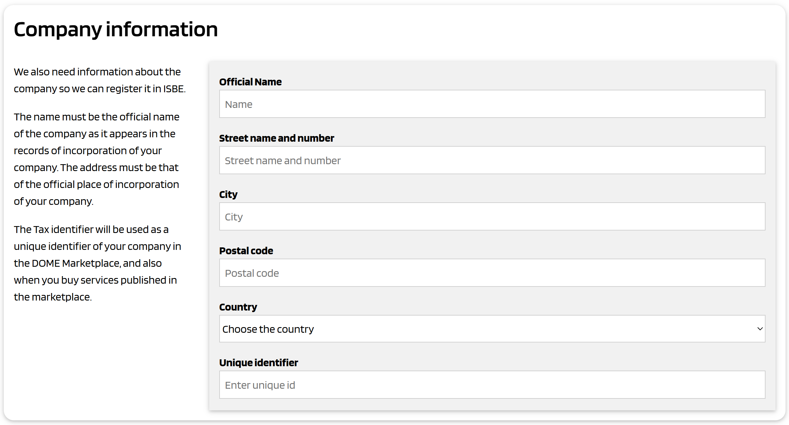

# Onboarding process

The onboarding process of an organization in ISBE consists of two phases.

The first phase is composed of the following steps:

1. Gather information about the organization and the employee acting on behalf of the organization in ISBE
2. Generate automatically contractual documents including that information
3. A legal representative of the organization signs the contractual documents
4. The documents are received and verified by ISBE
5. The organization is registered as onboarded in ISBE, and it has an account.

After the company is onboarded, ISBE generates a Verifiable Credential to the employee appointed during the first phase. This Verifiable Credential is an electronic mandate which will be used by the employee to authenticate to ISBE to operate the account of the organization.

This second phase is performed automatically after the first phase and consists of the following steps:

6. A Verifiable Credential is issued to the employee identified during the first phase
7. The employee accepts the credential and stores it in an EUDI-compatible wallet
8. The employee uses the credential to authenticate to the ISBE portal to complete the onboarding process, for example:
   - Complete information about the organization, like logo, commercial messages, etc.
   - Issue additional Verifiable Credentials to additional employees with specific powers to enable them perform some operatuions in the ISBE ecosystem.
   - Add product offerings and publish them in the ISBE Marketplace, to gain visibility and facilitate selling the services.

The following sections provide more details.

## Verify email of person driving the process

We allow that the person driving the process of onboarding be a normal employee, instead of a legal representative of the organization. Later in the process, the employee will have to submit one or more documents signed by a legal representative of the organization, to achieve the proper legal certainty in the onboarding process.

In any case, the person driving the process has to verify his/her email address. This is achieved in the following way:

1. A simple form is displayed in the ISBE onboarding page.
2. The person enters his/her name and email.
3. The ISBE onboarding system sends an email to the specified address with a verification mechanism (a one-time verification code).
4. The person uses the code to verify his/her email address.
5. The ISBE onboarding system stores the registration with that email address, and allows the person to continue with the process

## Accept terms and conditions

The person driving the process will have to accept the terms and conditions of ISBE. The above form is just an example. The acceptance will be registered in the onboarding database.

## Company information

The person driving the process will enter information about the company. The above form is just an example.

**Limitation on the country**: We only allow organizations which either have the headquarters incorporated in an EU/EEA country, or a legal representative in an EU/EEA country.

The user must select the country from a list with the allowed countries. We will check that the country is correct when later in the process we check the electronic signature of the contract that the company will send to ISBE.

## Information about the LEAR

This section identifies the person who will act as **LEAR** of the company.

The LEAR is the Legal Entity Appointed Representative, and she/he can be any person who is authorized by a legal representative of the company to act on behalf of the company within the ISBE ecosystem.

This is needed because normally the legal representative of the organization is not able to perform the day-to-day operations needed in ISBE. We allow the company (the legal representative of the company) to nominate/appoint a person to act on behalf of the company in ISBE.

### Why we need a LEAR appointment form?

The aim of the Legal Entity Appointed Representative (LEAR) Form is twofold: first, to provide legal certainty for ISBE that the actions taken by the people operating the account of a company are legally binding to the company, either vis-à-vis ISBE and the partners of the ISBE ecosystem; and second, as a consequence of the first, to generate a plus of trust in the ISBE ecosystem partners regarding the identity of the company.

Further, the LEAR having full power to bind the entity she/he represents is coherent with the verifiable credentials scheme that ISBE uses to allow a swift, fully digital and trustworthy system to structure communications and transactions within the ecosystem. 

The verifiable credentials system implemented in ISBE is based on the claim that the people operating the account of an organization have the authority to represent that organization and to legally bind it.

ISBE, that is the issuer of the verifiable credentials, needs to verify that the operators of the organization account in ISBE do have the powers needed to fully operate the account. This verification is made through the LEAR appointment form and the rest of the documentation requested in the onboarding phase.

### Who can be designated as a LEAR

Any person of legal age can be designated as the LEAR of an entity. There is not any further limitation on this aspect.

That means that an entity can appoint as its LEAR either an employee (regardless of its position in the company) or even someone who is not linked to the entity at all.

However, the entity appointing a LEAR should carefully consider who is the right person to fill the role.

This person should be someone who is trusted by the entity’s management and with the right qualifications and skills to hold this position, for his/her actions may yield legal liabilities on the entity.
 
Also, the same individual can be appointed as the LEAR by more than one entity. Each appointment will generate its own and separate verifiable credential, so the individual can only represent one single entity at a time when operating in the Marketplace.